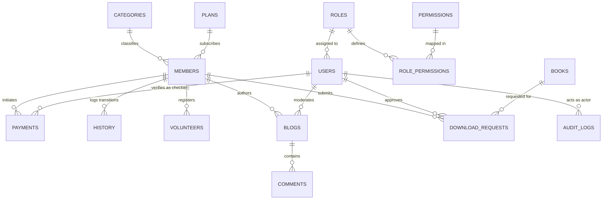

# Sanatan Philosophy and Scripture (SPS) — Comprehensive Technical Audit & Architectural Blueprint

> **Notice:** This document is an **exhaustive technical audit and architectural map** of the existing SPS repository located at `d:\AntiGravity Workspace\SPS`. In strict adherence to audit rules, **no project code has been altered, refactored, or fixed**. All architectural findings reflect the **actual current implementation** rather than an idealized specification. Sensitive credentials, encryption keys, salts, peppers, and passwords have been strictly excluded.

---

## 1. PROJECT IDENTITY

* **Project Name:** Sanatan Philosophy and Scripture (SPS) Bilingual Web Platform (`sps/platform`)
* **Purpose:** A scholarly, cultural, educational, and humanitarian non-profit platform balancing four institutional pillars:
  1. *Academic & Spiritual Rigor:* Scriptural exegesis, Vedanta and philosophical archives.
  2. *Community Co-Creation & Thought Journal:* Member articles, peer engagement, and tiered editorial moderation.
  3. *Scholarly Digital Library:* PDF streaming reader with DRM page-slicing and entitlement verification.
  4. *Humanitarian Seva & Financial Governance:* Real-world social service projects, bKash financial audit ledgers, printable digital membership cards with QR verification, and dual-layer administrative governance (Maker-Checker).
* **Current Development Status:** Working Prototype / Advanced Pre-Production Phase. Core features (Bilingual Routing, RBAC Governance, Member Lifecycle, bKash Payment Ledger, Digital Library DRM, Blogspot Journal, Activities Chronicle, Audit Logging, and 2FA/Google Identity) are implemented and functional. Four auxiliary public modules (`/knowledge`, `/get-involved`, `/transparency`, `/contact`) remain as Phase-1 placeholder shells.
* **Technology Stack:**
  * **Backend Runtime:** PHP 8.0.30 (x64 CLI, Thread-Safe)
  * **Database Engine (Active):** Flat-File JSON Document Store (`storage/data/*.json`) with file-locking (`flock`).
  * **Database Engine (Configured/Target):** MySQL 8 (`config/database.php` configures PDO connection parameters, and `docs/architecture.md` outlines a target relational schema, but MySQL is currently not invoked in active application code).
  * **JavaScript Approach:** Vanilla ES6+ JavaScript. No external UI frameworks (React/Vue). Uses native DOM manipulation, Fetch API, and targeted external micro-libraries: `qrcode.min.js` (client-side QR code generator) and Google Identity Services SDK (`https://accounts.google.com/gsi/client`).
  * **CSS / Styling Framework:** Custom Vanilla CSS Design System. No TailwindCSS, Bootstrap, or Sass. Structured using standard CSS Custom Properties / Tokens (`tokens.css`), Fluid Typography (`typography.css`), Global Resets (`reset.css`), Core Styles (`main.css`), and Reusable UI Components (`components.css`).
  * **Local Development Environment:** Windows 10/11, PowerShell, PHP built-in development server (`php -S 127.0.0.1:8000 -t public public/index.php`).
  * **Production / Deployment Environment:** Targeted for Linux/Apache/Nginx with Webroot set strictly to `/public`, WAF/HTTPS termination, and PHP-FPM. (Currently deployed strictly in local development).
* **Repository Structure:**
  ```
  SPS/
  ├── app/                        # MVC Application Root (PSR-4 App\)
  │   ├── Controllers/            # HTTP Request Handlers (8 Controllers)
  │   ├── Core/                   # Micro-Framework Engine (13 Core Classes & Helpers)
  │   ├── Services/               # Domain Services & Business Logic (14 Service Classes)
  │   └── Views/                  # Template Engine (Layouts, Components, Pages)
  ├── config/                     # Application, Database, and Locale Configuration
  ├── docs/                       # Architectural Blueprint & Master Specifications
  ├── lang/                       # Bilingual Localization Dictionaries (bn, en)
  ├── Media/                      # Protected Digital Assets, Original PDFs, and Executive Archives
  ├── public/                     # Public Webroot (Front Controller, Assets, Uploads)
  ├── routes/                     # Deterministic URI Routing (routes/web.php)
  ├── scripts/                    # Maintenance, Security Migration, and Helper Scripts
  ├── storage/                    # Flat-File JSON Databases, Logs, and Cache
  └── tests/                      # Automated Test Suites (17 PHP Test Scripts)
  ```
* **Main Entry Point:** [public/index.php](file:///d:/AntiGravity%20Workspace/SPS/public/index.php) (Front Controller).
* **Routing Mechanism:** Custom RESTful regex-based Router ([app/Core/Router.php](file:///d:/AntiGravity%20Workspace/SPS/app/Core/Router.php)), instantiated and dispatched via [app/Core/App.php](file:///d:/AntiGravity%20Workspace/SPS/app/Core/App.php). Dispatches routes defined in [routes/web.php](file:///d:/AntiGravity%20Workspace/SPS/routes/web.php).
* **Configuration Mechanism:** Dot-notation configuration loader ([App::config()](file:///d:/AntiGravity%20Workspace/SPS/app/Core/App.php#L56-L75)) reading PHP arrays from `config/*.php` combined with an environment loader ([app/Core/Env.php](file:///d:/AntiGravity%20Workspace/SPS/app/Core/Env.php)) parsing root `.env`.
* **Major Dependencies:**
  * `php`: `>=8.0`
  * `phpmailer/phpmailer`: `^7.1` (Loaded via Composer PSR-4 autoloading in [composer.json](file:///d:/AntiGravity%20Workspace/SPS/composer.json))
  * `pypdfium2`: Python PDF engine invoked by [pdf_slicer.py](file:///d:/AntiGravity%20Workspace/SPS/app/Services/pdf_slicer.py) for partial e-book slicing.

---

## 2. FEATURE INVENTORY

| Feature Name | Description | User / Role Involved | Related Pages | Related PHP Files | Related JS Files | Related DB Storage | Related Endpoints | Current Status |
|---|---|---|---|---|---|---|---|---|
| **Bilingual Localization (i18n)** | URI-prefixed (`/bn/`, `/en/`) language switching with cookie persistence and bidirectional translation dictionaries. | All Visitors & Users | All application pages | [I18n.php](file:///d:/AntiGravity%20Workspace/SPS/app/Core/I18n.php), [helpers.php](file:///d:/AntiGravity%20Workspace/SPS/app/Core/helpers.php), [config/languages.php](file:///d:/AntiGravity%20Workspace/SPS/config/languages.php) | [i18n-toggle.js](file:///d:/AntiGravity%20Workspace/SPS/public/assets/js/i18n-toggle.js) | Session / Cookie | `GET /{lang}/*` | **Working** |
| **Institutional Homepage** | Dynamic editorial landing page displaying hero banner, statistics, scripture quote, live activities slider, books, and articles. | Public Visitors | `pages/home.php` | [HomeController.php](file:///d:/AntiGravity%20Workspace/SPS/app/Controllers/HomeController.php), [HomepageService.php](file:///d:/AntiGravity%20Workspace/SPS/app/Services/HomepageService.php) | [main.js](file:///d:/AntiGravity%20Workspace/SPS/public/assets/js/main.js), [components.js](file:///d:/AntiGravity%20Workspace/SPS/public/assets/js/components.js) | `homepage_sections.json`, `site_settings.json` | `GET /{lang}` | **Working** |
| **Component Showcase** | Live UI design system displaying color tokens, buttons, cards, typography, and modal components. | Developers / Designers | `pages/components_showcase.php` | [HomeController.php](file:///d:/AntiGravity%20Workspace/SPS/app/Controllers/HomeController.php) | [components.js](file:///d:/AntiGravity%20Workspace/SPS/public/assets/js/components.js) | None | `GET /{lang}/components` | **Working** |
| **Institutional Overview & Leadership** | Displays SPS institutional character, mission, and Central Executive Committee profiles. | Public Visitors | `pages/about.php` | [SectionController.php](file:///d:/AntiGravity%20Workspace/SPS/app/Controllers/SectionController.php), [ExecutiveService.php](file:///d:/AntiGravity%20Workspace/SPS/app/Services/ExecutiveService.php) | None | Embedded array | `GET /{lang}/about` | **Working** |
| **Grassroots Activities Directory** | Comprehensive chronicle of welfare drives, temple renovations, medical relief, and Notion database tracker. | Public Visitors | `pages/activities.php` | [SectionController.php](file:///d:/AntiGravity%20Workspace/SPS/app/Controllers/SectionController.php), [ActivityService.php](file:///d:/AntiGravity%20Workspace/SPS/app/Services/ActivityService.php) | [components.js](file:///d:/AntiGravity%20Workspace/SPS/public/assets/js/components.js) | `activities.json` | `GET /{lang}/activities` | **Working** |
| **Section Preview Shells** | Informational placeholder cards for upcoming master modules (Knowledge, Get Involved, Transparency, Contact). | Public Visitors | `pages/section_preview.php` | [SectionController.php](file:///d:/AntiGravity%20Workspace/SPS/app/Controllers/SectionController.php) | None | None | `GET /{lang}/knowledge`, `GET /{lang}/get-involved`, `GET /{lang}/transparency`, `GET /{lang}/contact` | **Partially working** (Design shell active; models pending) |
| **Digital Library Catalog** | Categorized manuscript and e-book collection with group filtering, synopsis modal, and access badges. | Public / Registered / Members | `pages/library/index.php` | [LibraryController.php](file:///d:/AntiGravity%20Workspace/SPS/app/Controllers/LibraryController.php), [LibraryService.php](file:///d:/AntiGravity%20Workspace/SPS/app/Services/LibraryService.php) | [components.js](file:///d:/AntiGravity%20Workspace/SPS/public/assets/js/components.js) | `library_books.json` | `GET /{lang}/library` | **Working** |
| **Book Detail & Entitlement Gateway** | Displays publication metadata, chapters, reading scope, and download eligibility. | Public / Members | `pages/library/show.php` | [LibraryController.php](file:///d:/AntiGravity%20Workspace/SPS/app/Controllers/LibraryController.php), [LibraryService.php](file:///d:/AntiGravity%20Workspace/SPS/app/Services/LibraryService.php) | [components.js](file:///d:/AntiGravity%20Workspace/SPS/public/assets/js/components.js) | `library_books.json`, `download_requests.json` | `GET /{lang}/library/book/{slug}` | **Working** |
| **Protected E-Book Reader** | Fullscreen browser reader with page controls, zoom, and server-side PDF delivery. | Entitled Members / Admins | `pages/library/reader.php` | [LibraryController.php](file:///d:/AntiGravity%20Workspace/SPS/app/Controllers/LibraryController.php), [LibraryService.php](file:///d:/AntiGravity%20Workspace/SPS/app/Services/LibraryService.php) | Inline Reader JS | `library_books.json` | `GET /{lang}/library/reader/{slug}` | **Working** |
| **DRM PDF Streaming & Slicing** | Server-side stream of original PDFs for full access, or python-sliced partial previews for restricted users. | Server Internal | None | [LibraryController.php](file:///d:/AntiGravity%20Workspace/SPS/app/Controllers/LibraryController.php), [LibraryService.php](file:///d:/AntiGravity%20Workspace/SPS/app/Services/LibraryService.php), [pdf_slicer.py](file:///d:/AntiGravity%20Workspace/SPS/app/Services/pdf_slicer.py) | None | `Media/PDF-Libraries/*` | `GET /{lang}/library/stream/{slug}` | **Partially working** (Full stream works; slice fails gracefully to master PDF if python pypdfium2 missing) |
| **Library Download Request & Token Verification** | Controlled workflow for requesting offline copies, requiring administrative review before granting temporary token. | Registered Members & Library Manager | `pages/library/show.php`, `admin/library.php` | [LibraryController.php](file:///d:/AntiGravity%20Workspace/SPS/app/Controllers/LibraryController.php), [LibraryService.php](file:///d:/AntiGravity%20Workspace/SPS/app/Services/LibraryService.php) | [components.js](file:///d:/AntiGravity%20Workspace/SPS/public/assets/js/components.js) | `download_requests.json` | `POST /{lang}/library/download-request/{slug}`, `GET /{lang}/library/download/{slug}` | **Working** |
| **Library Role Simulator** | Development helper to switch active reading simulation between visitor, registered, paid member, and admin. | Developers / Testing | Header / Top bar | [LibraryController.php](file:///d:/AntiGravity%20Workspace/SPS/app/Controllers/LibraryController.php), [LibraryService.php](file:///d:/AntiGravity%20Workspace/SPS/app/Services/LibraryService.php) | None | Session | `POST /{lang}/library/role` | **Working** |
| **Membership Application & Onboarding** | Multi-step registration capturing academic/professional details, avatar upload, and mandatory bKash TrxID with Sent Money screenshot. | Prospective Members | `pages/membership/apply.php` | [MembershipController.php](file:///d:/AntiGravity%20Workspace/SPS/app/Controllers/MembershipController.php), [MembershipService.php](file:///d:/AntiGravity%20Workspace/SPS/app/Services/MembershipService.php), [FileUploader.php](file:///d:/AntiGravity%20Workspace/SPS/app/Core/FileUploader.php) | Inline searchable district/upazila JS | `membership.json` (`members`, `payments`) | `GET /{lang}/membership/apply`, `POST /{lang}/membership/apply` | **Working** |
| **Member Password-Protected Login** | Multi-identifier login (Member Code, Email, Phone) validating Argon2id password hash before initiating 2FA challenge. | Registered Members | `pages/membership/login.php` | [MembershipController.php](file:///d:/AntiGravity%20Workspace/SPS/app/Controllers/MembershipController.php), [MembershipService.php](file:///d:/AntiGravity%20Workspace/SPS/app/Services/MembershipService.php), [TwoFactorService.php](file:///d:/AntiGravity%20Workspace/SPS/app/Services/TwoFactorService.php) | None | `membership.json` | `GET /{lang}/membership/login`, `POST /{lang}/membership/login` | **Working** |
| **Member Two-Factor Authentication (2FA)** | 6-digit OTP dispatched to member's masked email with 10-minute validity and rate-limited resend. | Members | `pages/membership/2fa.php` | [MembershipController.php](file:///d:/AntiGravity%20Workspace/SPS/app/Controllers/MembershipController.php), [TwoFactorService.php](file:///d:/AntiGravity%20Workspace/SPS/app/Services/TwoFactorService.php), [EmailService.php](file:///d:/AntiGravity%20Workspace/SPS/app/Services/EmailService.php) | Inline OTP digit auto-focus JS | Session (`sps_2fa_member_pending`) | `GET /{lang}/membership/2fa`, `POST /{lang}/membership/2fa`, `POST /{lang}/membership/2fa/resend` | **Working** |
| **Member Google Identity Sign-in (GIS)** | One-click login and registration via cryptographically verified Google ID tokens (JWT). | Members | `pages/membership/google_auth.php` | [MembershipController.php](file:///d:/AntiGravity%20Workspace/SPS/app/Controllers/MembershipController.php), [GoogleAuthService.php](file:///d:/AntiGravity%20Workspace/SPS/app/Services/GoogleAuthService.php) | GIS Client SDK & Inline fetch JS | `membership.json` | `GET /{lang}/membership/auth/google`, `POST /{lang}/membership/auth/google/verify` | **Working** |
| **Member Self-Service Dashboard** | Personal portal displaying digital ID card, payment history, renewal form, category transition, and profile management. | Authenticated Members | `pages/membership/dashboard.php` | [MembershipController.php](file:///d:/AntiGravity%20Workspace/SPS/app/Controllers/MembershipController.php), [MembershipService.php](file:///d:/AntiGravity%20Workspace/SPS/app/Services/MembershipService.php) | [sps-qr.js](file:///d:/AntiGravity%20Workspace/SPS/public/assets/js/sps-qr.js) | `membership.json` | `GET /{lang}/membership/dashboard` | **Working** |
| **Pending Applicant Isolation** | Strict quarantine preventing pending applicants from viewing live digital cards or updating profiles until payment verification. | Pending Applicants | `pages/membership/dashboard.php` | [MembershipController.php](file:///d:/AntiGravity%20Workspace/SPS/app/Controllers/MembershipController.php) | None | `membership.json` | `GET /{lang}/membership/dashboard?as={code}` | **Working** |
| **Digital ID Card Live QR Verification** | Publicly accessible verification endpoint displaying official authenticity badge, member tier, and photo without leaking phone/email. | Public / Scanner | `pages/membership/verify.php` | [MembershipController.php](file:///d:/AntiGravity%20Workspace/SPS/app/Controllers/MembershipController.php), [QrCodeService.php](file:///d:/AntiGravity%20Workspace/SPS/app/Services/QrCodeService.php) | [sps-qr.js](file:///d:/AntiGravity%20Workspace/SPS/public/assets/js/sps-qr.js) | `membership.json` | `GET /{lang}/membership/verify` | **Working** |
| **Dedicated Printable Dual-Sided ID Card** | Clean, CSS-isolated printable layout rendering both front and back sides of the SPS Member Card with embedded QR. | Active Members | `pages/membership/card_print.php` | [MembershipController.php](file:///d:/AntiGravity%20Workspace/SPS/app/Controllers/MembershipController.php) | [qrcode.min.js](file:///d:/AntiGravity%20Workspace/SPS/public/assets/js/qrcode.min.js) | `membership.json` | `GET /{lang}/membership/card/print` | **Working** |
| **Member Renewal Payment Submission** | Dashboard-based monthly/yearly payment submission requiring TrxID and screenshot. | Active Members | `pages/membership/dashboard.php` | [MembershipController.php](file:///d:/AntiGravity%20Workspace/SPS/app/Controllers/MembershipController.php), [MembershipService.php](file:///d:/AntiGravity%20Workspace/SPS/app/Services/MembershipService.php) | None | `membership.json` (`payments`) | `POST /{lang}/membership/payment` | **Working** |
| **Student-to-Earning Category Transition** | Self-request workflow allowing graduated students to transition to earning members while preserving member code and audit history. | Members & Admins | `pages/membership/dashboard.php`, `admin/members.php` | [MembershipController.php](file:///d:/AntiGravity%20Workspace/SPS/app/Controllers/MembershipController.php), [MembershipService.php](file:///d:/AntiGravity%20Workspace/SPS/app/Services/MembershipService.php) | None | `membership.json` (`history`) | `POST /{lang}/membership/transition`, `POST /{lang}/admin/members/transition/{id}` | **Working** |
| **Member Anytime Profile & Photo Update** | Allows active members to edit personal details, education, occupation, and upload new avatar photos. | Active Members | `pages/membership/dashboard.php` | [MembershipController.php](file:///d:/AntiGravity%20Workspace/SPS/app/Controllers/MembershipController.php), [MembershipService.php](file:///d:/AntiGravity%20Workspace/SPS/app/Services/MembershipService.php) | None | `membership.json` | `POST /{lang}/membership/profile/update` | **Working** |
| **Member Self-Service Password Change** | Form in member dashboard allowing members to change passwords subject to validation. | Active Members | `pages/membership/dashboard.php` | [MembershipController.php](file:///d:/AntiGravity%20Workspace/SPS/app/Controllers/MembershipController.php), [MembershipService.php](file:///d:/AntiGravity%20Workspace/SPS/app/Services/MembershipService.php) | None | `membership.json` | `POST /{lang}/membership/password/update` | **Working** |
| **Member Logout** | Destroys active member session and flags logout state to prevent automatic fallback authentication. | Members | None | [MembershipController.php](file:///d:/AntiGravity%20Workspace/SPS/app/Controllers/MembershipController.php) | None | Session | `GET /{lang}/membership/logout`, `POST /{lang}/membership/logout` | **Working** |
| **Official Invoice & Money Receipt** | Publicly accessible money receipt verifying transaction details, breakdown, and official digital signature of Finance Secretary. | Public / Donors / Members | `pages/invoice/show.php`, `pages/invoice/lookup.php` | [InvoiceController.php](file:///d:/AntiGravity%20Workspace/SPS/app/Controllers/InvoiceController.php), [MembershipService.php](file:///d:/AntiGravity%20Workspace/SPS/app/Services/MembershipService.php) | None | `membership.json` (`payments`) | `GET /{lang}/invoice`, `GET /{lang}/invoice/{id}` | **Working** |
| **Floating 10-Taka Donation Gateway** | Persistent widget enabling instant micro-donations via bKash/Nagad and auto-redirecting to an official invoice. | Public Donors | `components/floating_donation.php` | [InvoiceController.php](file:///d:/AntiGravity%20Workspace/SPS/app/Controllers/InvoiceController.php), [MembershipService.php](file:///d:/AntiGravity%20Workspace/SPS/app/Services/MembershipService.php) | Inline widget JS | `membership.json` (`payments`) | `POST /{lang}/donation/submit` | **Working** |
| **Blog Feed & Journal (Blogspot clone)** | Chronological feed of approved essays, research articles, sidebar category list, and archive tree. | Public Visitors | `pages/blog/index.php` | [BlogController.php](file:///d:/AntiGravity%20Workspace/SPS/app/Controllers/BlogController.php), [BlogService.php](file:///d:/AntiGravity%20Workspace/SPS/app/Services/BlogService.php) | None | `blogs.json` | `GET /{lang}/blog` | **Working** |
| **Blog Article Reader & Social Interaction** | Full article view with view counter, toggle like mechanism, and Facebook-style comment stream. | Public Visitors & Members | `pages/blog/show.php` | [BlogController.php](file:///d:/AntiGravity%20Workspace/SPS/app/Controllers/BlogController.php), [BlogService.php](file:///d:/AntiGravity%20Workspace/SPS/app/Services/BlogService.php) | Inline AJAX like & comment JS | `blogs.json` | `GET /{lang}/blog/{slug}`, `POST /{lang}/blog/{slug}/like`, `POST /{lang}/blog/{slug}/comment` | **Working** |
| **Member Article Submission Desk** | Rich writing form restricted to paid members, with 10,000-word limit validation and automatic queuing for moderation. | Paid Members | `pages/blog/write.php` | [BlogController.php](file:///d:/AntiGravity%20Workspace/SPS/app/Controllers/BlogController.php), [BlogService.php](file:///d:/AntiGravity%20Workspace/SPS/app/Services/BlogService.php) | None | `blogs.json` | `GET /{lang}/blog/write`, `POST /{lang}/blog/write` | **Working** |
| **Admin Authentication (Argon2id + 2FA)** | Secure administrative sign-in enforcing Argon2id password verification, brute-force rate limiting, and email OTP dispatch. | Administrators | `pages/admin/login.php`, `pages/admin/2fa.php` | [AdminController.php](file:///d:/AntiGravity%20Workspace/SPS/app/Controllers/AdminController.php), [AuthService.php](file:///d:/AntiGravity%20Workspace/SPS/app/Services/AuthService.php), [TwoFactorService.php](file:///d:/AntiGravity%20Workspace/SPS/app/Services/TwoFactorService.php) | Inline OTP JS | `rbac.json` | `GET /{lang}/admin/login`, `POST /{lang}/admin/login`, `GET /{lang}/admin/2fa`, `POST /{lang}/admin/2fa` | **Working** |
| **Admin Google Identity Gateway** | Administrative sign-in with Google, restricted to a strict email whitelist (`allowed_admin_emails`). | Whitelisted Administrators | `pages/admin/login.php` | [AdminController.php](file:///d:/AntiGravity%20Workspace/SPS/app/Controllers/AdminController.php), [GoogleAuthService.php](file:///d:/AntiGravity%20Workspace/SPS/app/Services/GoogleAuthService.php) | GIS Client SDK & Inline fetch JS | `rbac.json` | `POST /{lang}/admin/auth/google/verify` | **Working** |
| **First-Login OTP Quarantine & Forced Password Change** | Detects `must_change_password` flag and quarantines session, restricting admin navigation until a unique password is set. | New Administrators | `pages/admin/force_password_change.php` | [AdminController.php](file:///d:/AntiGravity%20Workspace/SPS/app/Controllers/AdminController.php), [AuthService.php](file:///d:/AntiGravity%20Workspace/SPS/app/Services/AuthService.php), [PasswordPolicy.php](file:///d:/AntiGravity%20Workspace/SPS/app/Core/PasswordPolicy.php) | None | `rbac.json` | `GET /{lang}/admin/force-password-change`, `POST /{lang}/admin/force-password-change` | **Working** |
| **Admin Console & Governance Dashboard** | Central overview of members, pending payments, articles, system stats, and quick management links. | All Admin Roles | `pages/admin/dashboard.php` | [AdminController.php](file:///d:/AntiGravity%20Workspace/SPS/app/Controllers/AdminController.php) | None | `rbac.json`, `membership.json`, `blogs.json` | `GET /{lang}/admin`, `GET /{lang}/admin/dashboard` | **Working** |
| **User & Role Governance Desk** | Super Admin control room to create new admin users, assign roles, define departmental scopes, and grant task allowances. | Super Administrator | `pages/admin/users.php` | [AdminController.php](file:///d:/AntiGravity%20Workspace/SPS/app/Controllers/AdminController.php), [RbacService.php](file:///d:/AntiGravity%20Workspace/SPS/app/Services/RbacService.php) | Inline Role & Allowance Modal JS | `rbac.json` | `GET /{lang}/admin/users`, `POST /{lang}/admin/users/create`, `POST /{lang}/admin/users/assign-role` | **Working** |
| **Admin One-Time Password (OTP) Reset** | Super Admin workflow to generate a new temporary credential for an existing admin user and trigger forced change. | Super Administrator | `pages/admin/users.php` | [AdminController.php](file:///d:/AntiGravity%20Workspace/SPS/app/Controllers/AdminController.php), [RbacService.php](file:///d:/AntiGravity%20Workspace/SPS/app/Services/RbacService.php) | Inline Reset OTP Modal JS | `rbac.json` | `POST /{lang}/admin/users/reset-otp` | **Working** |
| **Role & Permission Matrix Inspector** | Read-only matrix illustrating 12 institutional roles and 57 granular permissions. | Administrators & Auditors | `pages/admin/roles.php` | [AdminController.php](file:///d:/AntiGravity%20Workspace/SPS/app/Controllers/AdminController.php), [RbacService.php](file:///d:/AntiGravity%20Workspace/SPS/app/Services/RbacService.php) | None | `rbac.json` | `GET /{lang}/admin/roles` | **Working** |
| **Finance Officer Exclusive Verification Desk** | Finance Desk allowing the Treasurer to inspect bKash receipts, verify TrxIDs, activate members, or reject payments. | Finance Officer (Supervisory View for Admins) | `pages/admin/members.php` | [AdminController.php](file:///d:/AntiGravity%20Workspace/SPS/app/Controllers/AdminController.php), [MembershipService.php](file:///d:/AntiGravity%20Workspace/SPS/app/Services/MembershipService.php) | Inline Receipt Zoom Modal JS | `membership.json` (`payments`) | `GET /{lang}/admin/finance`, `POST /{lang}/admin/members/payment/verify/{id}`, `POST /{lang}/admin/members/payment/reject/{id}` | **Working** |
| **Membership Governance Desk** | Member approval, rejection, suspension, activation, and category transition management. | Membership Officer / Admins | `pages/admin/members.php` | [AdminController.php](file:///d:/AntiGravity%20Workspace/SPS/app/Controllers/AdminController.php), [MembershipService.php](file:///d:/AntiGravity%20Workspace/SPS/app/Services/MembershipService.php) | None | `membership.json` | `GET /{lang}/admin/members`, `POST /{lang}/admin/members/approve/{id}`, `POST /{lang}/admin/members/reject/{id}`, `POST /{lang}/admin/members/suspend/{id}`, `POST /{lang}/admin/members/activate/{id}` | **Working** |
| **Library Management & Download Approvals** | Update e-book access tiers, modify page ranges, and review/approve download requests. | Library Manager / Admins | `pages/admin/library.php` | [AdminController.php](file:///d:/AntiGravity%20Workspace/SPS/app/Controllers/AdminController.php), [LibraryService.php](file:///d:/AntiGravity%20Workspace/SPS/app/Services/LibraryService.php) | Inline Book Edit Modal JS | `library_books.json`, `download_requests.json` | `GET /{lang}/admin/library`, `POST /{lang}/admin/library/book/{slug}/update`, `POST /{lang}/admin/library/download-request/{id}` | **Working** |
| **Activities Management Desk** | Create, edit, and delete social service activities, medical drives, and relief campaigns. | Super Admin & Admin | `pages/admin/activities.php` | [AdminController.php](file:///d:/AntiGravity%20Workspace/SPS/app/Controllers/AdminController.php), [ActivityService.php](file:///d:/AntiGravity%20Workspace/SPS/app/Services/ActivityService.php) | Inline Activity Modal JS | `activities.json` | `GET /{lang}/admin/activities`, `POST /{lang}/admin/activities/create`, `POST /{lang}/admin/activities/update/{id}`, `POST /{lang}/admin/activities/delete/{id}` | **Working** |
| **Blog Moderation Desk** | Review pending member submissions, approve for public display, reject with feedback, or delete. | Super Admin, Admin, Literature-Admin | `pages/admin/blogs.php` | [AdminController.php](file:///d:/AntiGravity%20Workspace/SPS/app/Controllers/AdminController.php), [BlogService.php](file:///d:/AntiGravity%20Workspace/SPS/app/Services/BlogService.php) | None | `blogs.json` | `GET /{lang}/admin/blogs`, `POST /{lang}/admin/blogs/approve/{id}`, `POST /{lang}/admin/blogs/reject/{id}`, `POST /{lang}/admin/blogs/delete/{id}` | **Working** |
| **Dynamic Homepage Sections CMS** | Toggle visibility and change display order of homepage modules. | Super Admin, Admin, Content Editor | `pages/admin/homepage.php` | [AdminController.php](file:///d:/AntiGravity%20Workspace/SPS/app/Controllers/AdminController.php), [HomepageService.php](file:///d:/AntiGravity%20Workspace/SPS/app/Services/HomepageService.php) | None | `homepage_sections.json` | `GET /{lang}/admin/homepage`, `POST /{lang}/admin/homepage` | **Working** |
| **Admin Profile & Credential Management** | Self-service profile editing and password updates for authenticated admins. | All Admin Accounts | `pages/admin/profile.php` | [AdminController.php](file:///d:/AntiGravity%20Workspace/SPS/app/Controllers/AdminController.php), [AuthService.php](file:///d:/AntiGravity%20Workspace/SPS/app/Services/AuthService.php) | None | `rbac.json` | `GET /{lang}/admin/profile`, `POST /{lang}/admin/profile` | **Working** |
| **Immutable Audit Logging System** | Automatic append-only logging of administrative actions, credential changes, approvals, and security alerts with data redaction. | Super Admin & Auditor | `pages/admin/audit_logs.php` | [AdminController.php](file:///d:/AntiGravity%20Workspace/SPS/app/Controllers/AdminController.php), [AuditService.php](file:///d:/AntiGravity%20Workspace/SPS/app/Services/AuditService.php) | None | `audit_logs.json` | `GET /{lang}/admin/audit-logs` | **Working** |
| **Role Simulator / User Impersonation** | Test/Debug helper allowing developers to switch between administrator accounts. | Developers / Testing | Admin Top Navigation | [AdminController.php](file:///d:/AntiGravity%20Workspace/SPS/app/Controllers/AdminController.php), [AuthService.php](file:///d:/AntiGravity%20Workspace/SPS/app/Services/AuthService.php) | None | Session | `POST /{lang}/admin/switch-user` | **Working** |
| **Admin Logout** | Invalidation of active administrative session, clearing quarantine and pre-auth state. | Administrators | None | [AdminController.php](file:///d:/AntiGravity%20Workspace/SPS/app/Controllers/AdminController.php), [AuthService.php](file:///d:/AntiGravity%20Workspace/SPS/app/Services/AuthService.php) | None | Session | `GET /{lang}/admin/logout`, `POST /{lang}/admin/logout` | **Working** |

---

## 3. ARCHITECTURE & REQUEST LIFECYCLE

### 3.1 Structural Overview
The application follows a custom **Front Controller & MVC (Model-View-Controller)** pattern with a domain-driven **Services Layer** and a **Flat-File JSON Storage Engine**.

```
+----------------------------------------------------------------------------------------------------+
|                                      1. BROWSER & CLIENT LAYER                                     |
|  - HTML5 Views (Layouts: main.php, admin.php)                                                      |
|  - Vanilla CSS Design System (tokens.css, typography.css, main.css, components.css)                |
|  - Vanilla JS (main.js, components.js, sps-qr.js, qrcode.min.js) & Inline Page Scripts             |
+----------------------------------------------------------------------------------------------------+
                                                  │ (HTTP GET/POST / AJAX Fetch)
                                                  ▼
+----------------------------------------------------------------------------------------------------+
|                                   2. FRONT CONTROLLER & BOOTSTRAP                                  |
|  Entry: public/index.php                                                                           |
|  Kernel: App\Core\App::__construct()                                                               |
|  - Loads environment: App\Core\Env::load()                                                         |
|  - Loads configs: config/app.php, config/languages.php, config/database.php                        |
|  - Configures error handling & timezone (Asia/Dhaka)                                               |
|  - Initializes session: App\Core\Session::start() (HttpOnly, SameSite=Lax, Timeout Check)          |
|  - Initializes HTTP Request: App\Core\Request                                                      |
|  - Initializes Localization Engine: App\Core\I18n::init() (detects /bn/ or /en/ from URL)         |
|  - Initializes View engine: App\Core\View::init()                                                  |
|  - Boots Router: App\Core\Router and loads routes/web.php                                          |
+----------------------------------------------------------------------------------------------------+
                                                  │
                                                  ▼
+----------------------------------------------------------------------------------------------------+
|                                    3. ROUTING & DISPATCH ENGINE                                    |
|  App\Core\Router::dispatch()                                                                       |
|  - Root '/' redirection: 302 redirect to '/{current_locale}'                                       |
|  - Compiles route patterns into regex (e.g. /{lang}/library/book/{slug})                           |
|  - Matches HTTP Method (GET/POST/HEAD) and extracts URI parameters                                 |
|  - Resolves target Controller and Action (e.g. MembershipController@submitApplication)             |
+----------------------------------------------------------------------------------------------------+
                                                  │
                                                  ▼
+----------------------------------------------------------------------------------------------------+
|                                  4. CONTROLLER & SECURITY GUARDS                                   |
|  BaseController / AdminController / MembershipController / LibraryController / etc.                |
|  - CSRF Verification: BaseController::validateCsrf()                                               |
|  - Admin Auth Guard: AdminController::requireAuth()                                                |
|  - Quarantine Check: AuthService::isQuarantined() -> redirect to force-password-change             |
|  - Authorization / RBAC: AuthService::can(), AuthService::hasRole(), Maker-Checker Verification   |
|  - Rate Limiting: App\Core\RateLimiter::tooManyAttempts(), applyProgressiveDelay()                 |
|  - Input Normalization & Sanity Checks                                                             |
+----------------------------------------------------------------------------------------------------+
                                                  │
                                                  ▼
+----------------------------------------------------------------------------------------------------+
|                                      5. DOMAIN SERVICES LAYER                                      |
|  Business logic, rules enforcement, crypto transformations, and data orchestration:                |
|  - AuthService / RbacService / TwoFactorService / GoogleAuthService                                |
|  - MembershipService / LibraryService / BlogService / ActivityService                              |
|  - CryptoService (AES-256-GCM AEAD, Argon2id + Pepper, Blind Indexing)                              |
|  - AuditService (Immutable audit log writer with automatic secret redaction)                       |
|  - EmailService (PHPMailer SMTP / native mail() fallback)                                          |
+----------------------------------------------------------------------------------------------------+
                                                  │
                                                  ▼
+----------------------------------------------------------------------------------------------------+
|                                  6. DATA ACCESS & STORAGE LAYER                                    |
|  Zero-Dependency JSON Flat-File Engine with file locking (LOCK_EX):                                |
|  - storage/data/membership.json (Members, Payments, Categories, Plans, History)                    |
|  - storage/data/rbac.json (Roles, Permissions, Users, Custom Allowances)                           |
|  - storage/data/blogs.json (Articles, Comments, Likes, Categories)                                 |
|  - storage/data/activities.json (Historical & Ongoing Seva Projects)                               |
|  - storage/data/library_books.json & storage/data/download_requests.json                           |
|  - storage/data/audit_logs.json (Max 1000 logs circular buffer)                                    |
|  - storage/data/homepage_sections.json & site_settings.json                                        |
+----------------------------------------------------------------------------------------------------+
                                                  │
                                                  ▼
+----------------------------------------------------------------------------------------------------+
|                                7. VIEW COMPILATION & HTTP RESPONSE                                 |
|  App\Core\View::render() & App\Core\Response::send()                                               |
|  - Renders View template (app/Views/pages/*.php) via output buffering (ob_start/ob_get_clean)       |
|  - Wraps in Layout (app/Views/layouts/main.php or admin.php)                                       |
|  - Injects CSRF token, localization variables, flash messages, navigation state                    |
|  - Sends HTTP Headers & Status Code (200, 302, 400, 403, 404, 500)                                 |
+----------------------------------------------------------------------------------------------------+
```

### 3.2 Concrete Request Lifecycle Examples

#### Flow A: Membership Application & bKash Payment Submission
```
Browser (User fills form at /bn/membership/apply and attaches bKash SS)
→ JS: Client-side validation & searchable district dropdown
→ HTTP POST: /{lang}/membership/apply
→ Entry: public/index.php
→ Router: Router::dispatch() resolves MembershipController@submitApplication
→ Controller Validation:
    - Verifies non-empty Name, Phone, valid Email
    - Enforces Password Policy (min 6 chars, match confirmation)
    - Validates mandatory TrxID
    - Validates mandatory Sent Money screenshot for bKash
→ File Handling:
    - Saves payment screenshot to public/assets/images/payments/pay_{uniqid}.{ext}
    - Validates and saves avatar to public/assets/images/members/
→ Domain Service: MembershipService::createApplication()
    - Generates next Member ID (SPS-001083) via MembershipService::generateNextMemberCode()
    - Generates Transaction ID (SPS-MEM-2026-XXXXXX)
    - Hashes password via CryptoService::hashPassword() (Argon2id + Pepper)
    - Encrypts Phone and Address via CryptoService::encrypt() (AES-256-GCM)
    - Generates Blind Index hashes (phone_bidx, phone_last10_bidx, trx_id_bidx)
    - Encrypts Payment TrxID and Sender Number
    - Appends record to storage/data/membership.json (flock / file_put_contents)
→ Audit Log: AuditService::log('membership.applied', ...) -> storage/data/audit_logs.json
→ Response: MembershipController sets Flash Success, issues 302 redirect to /{lang}/membership/dashboard?as=SPS-XXXXXX
→ Browser: Displays Pending Dashboard (Digital Card hidden, waiting message displayed).
```

#### Flow B: Finance Officer Payment Verification & Member Activation
```
Browser (Treasurer clicks "Verify Payment" on /bn/admin/members?tab=payments)
→ HTTP POST: /{lang}/admin/members/payment/verify/{id}
→ Entry: public/index.php
→ Router: Router::dispatch() resolves AdminController@verifyMemberPayment
→ Controller Guard:
    - AdminController::requireAuth() verifies active admin session
    - Authorization check: Strictly verifies user role is 'finance_officer'
    - Maker-Checker check: Prevents non-finance admins from executing verification
→ Domain Service: MembershipService::verifyPayment($paymentId, $adminUser)
    - Reads storage/data/membership.json
    - Updates payment status to 'Verified', sets verified_at and verified_by
    - Finds associated member: updates status to 'Active', computes expiry date
    - Saves updated JSON with lock
→ Email Dispatch: EmailService::sendMembershipApprovedEmail()
    - Dispatches confirmation email with Money Receipt link to member
→ Audit Log: AuditService::log('payment.verified', 'finance', ...)
→ Response: AdminController sets Flash Success, redirects back to /admin/members?tab=payments
→ Browser: Member is now Active; Digital ID Card unlocked on dashboard.
```

---

## 4. DATABASE SCHEMA & RELATIONSHIPS

### 4.1 Architecture Note: Relational Target vs. Active Flat-File Store
There is a fundamental dual reality in this repository:
* **The Target Specification (`docs/architecture.md`):** Documents a planned MySQL 8 schema with 25+ relational tables, foreign key constraints, and multi-row translation tables (`pages`, `page_translations`, `posts`, `post_translations`, `scriptures`, `books`, `orders`, `donations`, `expenses`).
* **The Actual Implementation (`storage/data/*.json`):** All active services (`MembershipService`, `RbacService`, `BlogService`, `LibraryService`, `ActivityService`, `HomepageService`, `AuditService`) directly read and write to flat JSON document files.

The audit below documents the **actual collections and documents** currently governing the application in `storage/data/`.

---

### 4.2 Document Collection: `storage/data/membership.json`

#### Collection 1: `members`
* **Purpose:** Stores registered member accounts, cryptographic credentials, category tiers, and profile details.
* **Fields:**

| Field | Inferred Data Type | Nullable | Encrypted / Hashed | Purpose / Constraints |
|---|---|---|---|---|
| `id` | String | No | No | Unique internal identifier (e.g. `mem_6abd5a315e12a`). |
| `member_code` | String | No | No | Unique lifetime member code (e.g. `SPS-000872`). Primary business key. |
| `name_bn` | String | No | No | Member full name in Bengali script. |
| `name_en` | String | No | No | Member full name in English. |
| `email` | String | No | No | Email address (unique for login lookup). |
| `phone` | String | No | **Yes (AES-256-GCM)** | Confidential mobile number. Format: `enc:v1:gcm:...` |
| `phone_bidx` | String | Yes | HMAC-SHA256 | Keyed blind index of full normalized phone for exact search. |
| `phone_last10_bidx`| String | Yes | HMAC-SHA256 | Keyed blind index of last 10 digits for local lookup. |
| `password_hash` | String | No | **Yes (Argon2id+Pepper)** | Cryptographic password hash. |
| `password_changed_at`| String (DateTime)| Yes | No | Timestamp of last credential update. |
| `auth_version` | Integer | No | No | Incremented on credential change to invalidate stale sessions. Default `1`. |
| `google_id` | String | Yes | No | Google sub identifier for linked Google accounts. |
| `avatar` | String | No | No | Relative path to profile picture (e.g. `assets/images/members/...`). |
| `category_id` | String | No | No | Foreign reference to `categories.id` (`STUDENT` or `EARNING`). |
| `plan_id` | String | No | No | Foreign reference to `plans.id` (`STUDENT_MONTHLY`, `YEARLY`, `LIFETIME`). |
| `status` | String | No | No | Status string: `Pending Finance Approval`, `Active`, `Lifetime Active`, `Suspended`, `Rejected`. |
| `district` | String | Yes | No | District / Zilla name. |
| `upazila` | String | Yes | No | Upazila / Police Station name. |
| `address` | String | Yes | **Yes (AES-256-GCM)** | Confidential physical address. Format: `enc:v1:gcm:...` |
| `blood_group` | String | Yes | No | Blood group (e.g. `B+`, `O+`). |
| `bio` | String | Yes | No | Personal biographical note. |
| `education` | Object (JSON) | Yes | No | Embedded dictionary: `institution`, `department`, `class_year`, `student_id`. |
| `profession` | Object (JSON) | Yes | No | Embedded dictionary: `designation`, `institution`, `business_category`, `skills`. |
| `join_date` | String (Date) | No | No | Date of initial membership application (`Y-m-d`). |
| `start_date` | String (Date) | Yes | No | Date of membership activation. |
| `end_date` | String (Date) | Yes | No | Expiration date of current billing cycle. |
| `next_payment_date`| String (Date) | Yes | No | Next scheduled renewal payment date. |
| `is_lifetime` | Boolean | No | No | `true` if member subscribed to Lifetime Plan. |
| `entry_fee_paid` | Number (Float) | No | No | Entry fee component collected. |
| `total_paid` | Number (Float) | No | No | Aggregated total amount paid by member. |
| `recognitions` | Array of Strings | Yes| No | Badges / recognitions (e.g. `["Verified Scholar"]`). |
| `card_qr_token` | String | No | No | Unique verification token embedded in printable card QR code. |
| `volunteer_profile`| Object (JSON) | Yes | No | Volunteer application status, interests, and availability. |
| `notes` | String | Yes | No | Administrative remarks. |
| `created_at` | String (DateTime)| Yes | No | Timestamp of record creation. |
| `updated_at` | String (DateTime)| Yes | No | Timestamp of last modification. |

#### Collection 2: `payments`
* **Purpose:** Append-only ledger recording membership entry fees, renewals, and donations.
* **Fields:**

| Field | Inferred Data Type | Nullable | Encrypted / Hashed | Purpose / Constraints |
|---|---|---|---|---|
| `id` | String | No | No | Unique internal identifier (e.g. `pay_6abd5a315d15a`). |
| `transaction_id` | String | No | No | SPS official ledger transaction ID (e.g. `SPS-MEM-2026-454211`, `SPS-DON-2026-XXXX`). |
| `member_id` | String | No | No | Reference to `members.id` or `'NON-MEMBER'`. |
| `member_code` | String | No | No | Reference to `members.member_code` or `'NON-MEMBER'`. |
| `amount` | Number (Float) | No | No | Payment amount in BDT. |
| `currency` | String | No | No | Currency code (default `'BDT'`). |
| `payment_type` | String | No | No | Type: `initial_application`, `monthly`, `yearly`, `lifetime`, `donation`. |
| `payment_method`| String | No | No | Channel: `bKash`, `Nagad`, `Rocket`, `Bank Transfer`. |
| `trx_id` | String | No | **Yes (AES-256-GCM)** | Provider transaction reference. Format: `enc:v1:gcm:...` |
| `trx_id_bidx` | String | Yes | HMAC-SHA256 | Keyed blind index of normalized provider TrxID. |
| `sender_number` | String | Yes | **Yes (AES-256-GCM)** | Sender phone number. Format: `enc:v1:gcm:...` |
| `sender_name` | String | Yes | No | Name of account holder who initiated payment. |
| `payment_time` | String (DateTime)| Yes | No | Self-reported timestamp of payment. |
| `payment_reference`| String | Yes | No | Reference text entered during bKash transfer. |
| `payment_screenshot`| String | Yes | No | Relative path to uploaded Sent Money screenshot image. |
| `status` | String | No | No | Status: `Pending`, `Verified`, `Rejected`. |
| `payment_date` | String (Date) | No | No | Date recorded (`Y-m-d`). |
| `period_start` | String (Date) | Yes | No | Start of coverage period. |
| `period_end` | String (Date) | Yes | No | End of coverage period. |
| `verified_by` | String | Yes | No | Admin user ID who audited payment (Maker-Checker). |
| `verified_at` | String (DateTime)| Yes | No | Timestamp of verification. |
| `notes` | String | Yes | No | Transaction remarks or rejection reasons. |

#### Collection 3: `categories` & `plans`
* **`categories`:** Defines membership classes (`STUDENT`, `EARNING`) with `id`, `name_bn`, `name_en`, `entry_fee`, `monthly_fee`, and `active`.
* **`plans`:** Billing tiers (`STUDENT_MONTHLY`, `EARNING_MONTHLY`, `YEARLY`, `LIFETIME`) with `fee`, `recurring_fee`, `duration_months`, and `total_first_payment`.

#### Collection 4: `history`
* **Purpose:** Audit record of member category changes (e.g. Student transitioning to Earning).
* **Fields:** `id`, `member_id`, `member_code`, `old_category`, `new_category`, `old_plan`, `new_plan`, `reason`, `changed_by`, `changed_at`.

---

### 4.3 Document Collection: `storage/data/rbac.json`

#### Collection 1: `users` (Admin Accounts)
* **Fields:** `id` (e.g. `usr_anik`), `username`, `name_bn`, `name_en`, `email`, `designation_bn`, `designation_en`, `role` (foreign key to `roles.id`), `adminship`, `scope`, `status`, `password_hash` (Argon2id+Pepper), `auth_version`, `must_change_password` (Boolean), `temporary_credential_expires_at`, `custom_permissions` (Array of permission strings), `created_at`, `updated_at`.

#### Collection 2: `roles`
* **Fields:** `id` (Slug), `name_bn`, `name_en`, `level` (10-100), `description_bn`, `description_en`, `access_level`, `badge_class`, `is_system_role`.

#### Collection 3: `permissions`
* **Fields:** `id` (e.g. `members.approve`), `resource` (e.g. `members`), `action` (e.g. `approve`), `name_bn`, `name_en`.

#### Collection 4: `role_permissions`
* **Fields:** Key-value map mapping `role_id` to an array of permission ID strings.

---

### 4.4 Document Collection: `storage/data/blogs.json`
* **Top-Level:** Array of article objects.
* **Fields:**
  * `id`: Unique post ID (e.g. `blog-1`).
  * `slug`: SEO URL slug (e.g. `vedanta-and-modern-science`).
  * `title_bn`, `title_en`: Multilingual article titles.
  * `category`: Slug (`vedanta`, `upanishad`, `history`, `gita`).
  * `featured_image`: Image asset path.
  * `excerpt_bn`, `excerpt_en`: Short summary.
  * `content_bn`, `content_en`: Full HTML article body.
  * `tags`: Array of string labels.
  * `author`: Embedded object (`name_bn`, `name_en`, `role`, `tier_bn`, `tier_en`, `avatar`, `email`).
  * `status`: Article workflow status (`published`, `pending`, `rejected`).
  * `published_at`, `created_at`, `updated_at`: Timestamps.
  * `approved_by`, `approved_at`, `rejection_reason`: Moderation audit fields.
  * `views_count`: Integer view counter.
  * `likes_count`: Integer reaction counter.
  * `liked_ips`: Array of IP addresses / user IDs who toggled like.
  * `comments`: Array of comment objects (`id`, `author_name`, `author_email`, `author_role`, `author_avatar`, `content`, `created_at`, `likes`).

---

### 4.5 Document Collection: `storage/data/library_books.json` & `download_requests.json`
* **`library_books.json`:** Array of publication records:
  * `id`: Integer ID.
  * `slug`: Unique book slug (e.g. `sps-ramnavami`).
  * `folder`: Physical media subfolder (`SPS Publications` or `Other Publications`).
  * `category_group`: Group key (`sps`, `other`).
  * `title_bn`, `title_en`: Book title.
  * `original_filename`: Physical file name in `Media/PDF-Libraries/`.
  * `file_path`: Resolved relative or absolute path.
  * `cover_image`: Cover graphic asset path.
  * `author_bn`, `author_en`, `publisher_bn`, `publisher_en`: Bibliographical data.
  * `publication_year`, `pages_count`, `file_size`: Physical attributes.
  * `reading_access`: Access level (`public`, `registered`, `paid_members`, `selected_users`).
  * `reading_scope`: Scope (`full`, `partial`).
  * `preview_start`, `preview_end`: Integer page boundaries for partial access.
  * `download_permission`: Permission tier (`disabled`, `paid_members`, `admin_approval_required`).
  * `allow_download_request`: Boolean flag.
  * `synopsis_bn`, `synopsis_en`, `topics`: Metadata and search tags.
* **`download_requests.json`:**
  * `id`: Request ID (e.g. `dlreq_1790744149_340`).
  * `book_slug`: Reference to book slug.
  * `user_name`, `user_email`, `member_code`, `user_type`, `membership_status`: Requester info.
  * `reason`: Justification text.
  * `status`: `pending`, `approved`, `rejected`.
  * `download_token`: Hexadecimal security token generated on approval.
  * `download_count`: Download counter.
  * `expires_at`: Token expiry timestamp (typically 48 hours to 7 days).
  * `admin_note`: Remarks left by Library Manager.

---

### 4.6 Document Collection: `storage/data/audit_logs.json`
* **Structure:** Circular array of maximum 1,000 immutable log entries:
  * `id`: Unique audit ID (e.g. `audit_1042_a9f1b2`).
  * `user_id`: Actor admin user ID, member ID, or `'system'`.
  * `user_name`: Actor display name.
  * `role`: Actor role slug.
  * `action`: Action verb (`auth.login_success`, `payment.verified`, `users.role_assigned`, etc.).
  * `resource`: Module (`security`, `membership`, `finance`, `blog`, `library`).
  * `target_id`: ID of target entity affected.
  * `target_name`: Display name of target entity.
  * `old_values`: Redacted JSON dictionary of prior state.
  * `new_values`: Redacted JSON dictionary of updated state.
  * `notes`: Human-readable summary note.
  * `ip_address`: Resolved client IP.
  * `user_agent`: HTTP User-Agent string.
  * `created_at`: Exact timestamp (`Y-m-d H:i:s`).

---

### 4.7 Entity-Relationship (ER) Overview Across Collections



---

## 5. AUTHENTICATION FLOWS

The application implements three parallel authentication systems: **Admin Authentication**, **Member Authentication**, and **Federated Google Identity**.

```
                   +-----------------------------------------------+
                   |           SPS AUTHENTICATION ENTRY            |
                   +-----------------------------------------------+
                                     │
           ┌─────────────────────────┼─────────────────────────┐
           ▼                         ▼                         ▼
   [Admin Portal Flow]      [Member Portal Flow]       [Google GIS OAuth]
   /admin/login             /membership/login          /auth/google/verify
           │                         │                         │
     Identifier +              Identifier +              Google ID Token
   Argon2id Password         Argon2id Password             (JWT Verify)
           │                         │                         │
           ▼                         ▼                         ▼
   [2FA OTP Challenge]       [2FA OTP Challenge]       [Auto Link / Provision]
   Dispatched to Admin       Dispatched to Member      Email Whitelist (Admin)
   Email (10m Expiry)        Email (10m Expiry)        or Auto-Member Provision
           │                         │                         │
           ▼                         ▼                         ▼
   [Quarantine Check]        [Session Active]          [Session Established]
   must_change_password?     current_member_code       auth_admin_user_id or
   -> Force Password Change  Dashboard Unlocked        current_member_code
```

### 5.1 Member Registration
* **Entry Point:** `GET /{lang}/membership/apply` → `POST /{lang}/membership/apply`
* **Relevant Files:** [MembershipController.php](file:///d:/AntiGravity%20Workspace/SPS/app/Controllers/MembershipController.php#L78-L251), [MembershipService.php](file:///d:/AntiGravity%20Workspace/SPS/app/Services/MembershipService.php#L771-L840)
* **Validation:** Mandatory Name, Phone, Email (checked for uniqueness), Password (min 6 chars, match confirmation), Category, Plan, TrxID, and bKash Sent Money screenshot.
* **Security Controls:** Password hashed via [CryptoService::hashPassword()](file:///d:/AntiGravity%20Workspace/SPS/app/Core/CryptoService.php#L146) using Argon2id + Pepper. Phone, address, TrxID, and sender number encrypted via AES-256-GCM. Blind index hashes generated.
* **Redirect / Behavior:** Redirects to `/membership/dashboard?as={member_code}` with warning that account is pending approval. **Session is NOT established** (Strict quarantine of unapproved applicants).

### 5.2 Member Login & 2FA Flow
* **Entry Point:** `GET /{lang}/membership/login` → `POST /{lang}/membership/login`
* **Relevant Files:** [MembershipController.php](file:///d:/AntiGravity%20Workspace/SPS/app/Controllers/MembershipController.php#L289-L401), [MembershipService.php](file:///d:/AntiGravity%20Workspace/SPS/app/Services/MembershipService.php#L510-L545), [TwoFactorService.php](file:///d:/AntiGravity%20Workspace/SPS/app/Services/TwoFactorService.php#L190-L280)
* **Validation:** Identifier lookup via blind index / email / code. Strict password verification via [CryptoService::verifyPassword()](file:///d:/AntiGravity%20Workspace/SPS/app/Core/CryptoService.php#L158). Checks if member status is Pending (if pending, redirects with warning; denies login).
* **2FA Challenge:** Generates cryptographically random 6-digit OTP ([random_int(100000, 999999)](file:///d:/AntiGravity%20Workspace/SPS/app/Services/TwoFactorService.php#L210)). Stores HMAC-SHA256 hash of OTP in session `sps_2fa_member_pending`. Dispatches email to member via [EmailService::send2FaOtp()](file:///d:/AntiGravity%20Workspace/SPS/app/Services/EmailService.php#L35).
* **2FA Verification:** `POST /{lang}/membership/2fa`. Compares HMAC digest of user input using `hash_equals()`. Rate limits failed attempts (max 5). On success, calls [Session::regenerate(true)](file:///d:/AntiGravity%20Workspace/SPS/app/Core/Session.php#L166), sets `current_member_code`, and redirects to `/membership/dashboard`.

### 5.3 Admin Login & 2FA Flow
* **Entry Point:** `GET /{lang}/admin/login` → `POST /{lang}/admin/login`
* **Relevant Files:** [AdminController.php](file:///d:/AntiGravity%20Workspace/SPS/app/Controllers/AdminController.php#L67-L200), [AuthService.php](file:///d:/AntiGravity%20Workspace/SPS/app/Services/AuthService.php#L71-L189), [TwoFactorService.php](file:///d:/AntiGravity%20Workspace/SPS/app/Services/TwoFactorService.php#L44-L185)
* **Rate Limiting:** Enforces [RateLimiter::tooManyAttempts()](file:///d:/AntiGravity%20Workspace/SPS/app/Core/RateLimiter.php#L32) (max 5 failed attempts per 15 minutes per IP and per account). Applies progressive delay (`usleep`) to mitigate timing attacks.
* **Enumeration Defense:** Constant-time [CryptoService::dummyVerify()](file:///d:/AntiGravity%20Workspace/SPS/app/Core/CryptoService.php#L106) executed if user is not found, ensuring lookup time is indistinguishable.
* **Password Verification:** Argon2id + Pepper verification. Auto-rehashes legacy Bcrypt hashes to Argon2id upon valid login.
* **2FA Challenge:** Dispatches 6-digit OTP to admin email. Verification sets `auth_admin_user_id` and regenerates session.

### 5.4 First-Login OTP Quarantine & Forced Password Change
* **Entry Point:** Handled via [AdminController::requireAuth()](file:///d:/AntiGravity%20Workspace/SPS/app/Controllers/AdminController.php#L26-L62) → `GET/POST /{lang}/admin/force-password-change`
* **Mechanism:** When a new admin is created, Super Admin issues a temporary credential and flags `must_change_password = true`.
* **Quarantine Enforcement:** [AuthService::isQuarantined()](file:///d:/AntiGravity%20Workspace/SPS/app/Services/AuthService.php#L463) intercepts all admin requests. If quarantined, access to all endpoints (except `/force-password-change` and `/logout`) is blocked with HTTP 403 / redirect.
* **Submission:** Enforces enterprise [PasswordPolicy::validate()](file:///d:/AntiGravity%20Workspace/SPS/app/Core/PasswordPolicy.php#L70) (min 12 chars, no common/breached passwords, no username fragments). Increments `auth_version`, clears `must_change_password`, regenerates session ID, logs to audit trail, and sends security alert email.

### 5.5 Google Identity Services (GIS) OAuth Flow
* **Entry Point:** `POST /{lang}/membership/auth/google/verify` and `POST /{lang}/admin/auth/google/verify`
* **Relevant Files:** [GoogleAuthService.php](file:///d:/AntiGravity%20Workspace/SPS/app/Services/GoogleAuthService.php), [MembershipController.php](file:///d:/AntiGravity%20Workspace/SPS/app/Controllers/MembershipController.php#L451-L514), [AdminController.php](file:///d:/AntiGravity%20Workspace/SPS/app/Controllers/AdminController.php#L89-L160)
* **Verification:** JWT ID token sent from browser is cryptographically verified against Google's official `https://oauth2.googleapis.com/tokeninfo` endpoint with SSL peer verification and audience check (`aud === client_id`).
* **Admin Authorization:** Matches against [GoogleAuthService::getAllowedAdminEmails()](file:///d:/AntiGravity%20Workspace/SPS/app/Services/GoogleAuthService.php#L33) whitelist. Unauthorized Gmail addresses are rejected with HTTP 403.
* **Member Provisioning:** Matches existing member by email/google_id or automatically provisions a new member account with an active yearly tier.

### 5.6 Logout Flow
* **Admin:** `GET/POST /{lang}/admin/logout` calls [AuthService::logout()](file:///d:/AntiGravity%20Workspace/SPS/app/Services/AuthService.php#L299), which logs the logout event, unsets all `$_SESSION` keys, invalidates session cookie, calls `session_destroy()`, and regenerates a clean guest session.
* **Member:** `GET/POST /{lang}/membership/logout` calls [MembershipController::logout()](file:///d:/AntiGravity%20Workspace/SPS/app/Controllers/MembershipController.php#L608), clears `current_member_code`, sets `member_logged_out = true`, and clears 2FA pending challenges.

---

## 6. AUTHORIZATION & ACCESS CONTROL (RBAC)

### 6.1 Institutional User Roles
The platform defines **12 distinct roles** in [storage/data/rbac.json](file:///d:/AntiGravity%20Workspace/SPS/storage/data/rbac.json) managed by [RbacService.php](file:///d:/AntiGravity%20Workspace/SPS/app/Services/RbacService.php):

1. **`super_admin` (Level 100):** Platform sovereign. Full access to all modules, role assignments, custom allowances, user creation, and configuration.
2. **`admin` (Level 80):** Operational administrator. Manages members, content, library, activities, and approvals.
3. **`finance_officer` (Level 70 - Treasurer):** Holds exclusive execution authority over financial ledgers, bKash verification, and payment-triggered member approvals.
4. **`content_editor` (Level 60):** Editorial control over website pages, homepage sections, and scripture archives.
5. **`project_manager` (Level 60):** Manages activities, field seva, beneficiaries, and project tracking.
6. **`library_manager` (Level 60):** Manages book catalog, access tiers, and reviews download requests.
7. **`blog_moderator` (Level 55):** Reviews, approves, or rejects member-submitted blog posts.
8. **`membership_officer` (Level 55):** Handles member applications, volunteer profiles, and status transitions.
9. **`order_manager` (Level 50):** Manages physical book orders and dispatch workflows.
10. **`volunteer_coordinator` (Level 50):** Coordinates volunteer applications and project deployment.
11. **`auditor` (Level 45):** Read-only visibility into financial ledgers, statistics, and immutable audit logs.
12. **`moderator` (Level 40):** Comments moderation and community feedback curation.

### 6.2 Permission Evaluation Engine
Authorization checks are performed via [AuthService::can()](file:///d:/AntiGravity%20Workspace/SPS/app/Services/AuthService.php#L356):
1. **Super Admin Bypass:** If user's role is `super_admin`, returns `true` for any permission.
2. **Custom Allowance Check:** Super Admin can assign specific ad-hoc task permissions (`custom_permissions` array) to any user regardless of their role. If permission exists in user's allowances, returns `true`.
3. **Role Matrix Resolution:** Looks up permissions assigned to the user's role in `role_permissions` mapping in `rbac.json`.

### 6.3 Maker-Checker Financial Rule
The platform strictly enforces the **Maker-Checker separation of duty** principle in financial governance:
* **Rule:** An administrator who creates an application or submits a payment cannot be the sole approver.
* **Enforcement:** [AuthService::isEligibleChecker($makerId)](file:///d:/AntiGravity%20Workspace/SPS/app/Services/AuthService.php#L421) ensures that the actor approving a transaction is distinct from the actor who initiated it.
* **Supervisory Isolation:** In [AdminController::verifyMemberPayment()](file:///d:/AntiGravity%20Workspace/SPS/app/Controllers/AdminController.php#L950-L985), Super Admins and general Admins are restricted to a read-only "Supervisory Monitoring Mode". Only the `finance_officer` can execute payment verifications.

### 6.4 Authorization Deficiencies & Edge Cases
1. **Simulated Role Persistence in Library:** [LibraryService::getCurrentRole()](file:///d:/AntiGravity%20Workspace/SPS/app/Services/LibraryService.php#L435) checks `Session::get('user_simulated_role')`. If set, it overrides actual authentication checks. If not disabled in production, any user hitting `POST /{lang}/library/role` could elevate their reader simulation to `admin`.
2. **Missing Controller Middleware Layer:** Authorization is currently checked imperatively at the start of individual controller action methods (e.g. `if (!AuthService::can(...))`) rather than through an automated HTTP middleware pipeline.
3. **No Dynamic Permission Check on Blog Submission:** Blog submission in [BlogController::submitPost()](file:///d:/AntiGravity%20Workspace/SPS/app/Controllers/BlogController.php#L159) checks a POST parameter `membership_tier` and session `member_mode` rather than validating that an actual authenticated member session exists.

---

## 7. SECURITY AUDIT

| Security Control | Status | Responsible File & Function / Class | Findings & Technical Rationale |
|---|---|---|---|
| **Password Hashing** | **Implemented** | [CryptoService::hashPassword()](file:///d:/AntiGravity%20Workspace/SPS/app/Core/CryptoService.php#L146) | Argon2id (`memory_cost=65536`, `time_cost=4`, `threads=2`) with fail-closed server-side HMAC-SHA256 pepper. Auto-rehashes legacy Bcrypt hashes on login. |
| **Pepper / HMAC** | **Implemented** | [CryptoService::getPepper()](file:///d:/AntiGravity%20Workspace/SPS/app/Core/CryptoService.php#L60) | Strict fail-closed policy: throws `RuntimeException` if `PASSWORD_PEPPER` is missing or invalid 64-hex/32-byte string. Never leaks pepper. |
| **Data Encryption (At Rest)** | **Implemented** | [CryptoService::encrypt()](file:///d:/AntiGravity%20Workspace/SPS/app/Core/CryptoService.php#L198), [decrypt()](file:///d:/AntiGravity%20Workspace/SPS/app/Core/CryptoService.php#L237) | Authenticated Encryption with Associated Data (AEAD) using `AES-256-GCM`. Key rotation supported via `APP_KEY_ACTIVE` (`enc:v1:gcm:...`). Applied to Phone, Address, TrxID, and Sender Number. |
| **Blind Indexing (Searchable Encryption)**| **Implemented** | [CryptoService::blindIndex()](file:///d:/AntiGravity%20Workspace/SPS/app/Core/CryptoService.php#L280) | Keyed HMAC-SHA256 hash using `BLIND_INDEX_KEY` on normalized strings (`phone_bidx`, `trx_id_bidx`), enabling exact lookups over ciphertext without exposing plaintext. |
| **CSRF Protection** | **Partial** | [Session::validateCsrfToken()](file:///d:/AntiGravity%20Workspace/SPS/app/Core/Session.php#L154), [BaseController::validateCsrf()](file:///d:/AntiGravity%20Workspace/SPS/app/Controllers/BaseController.php#L47) | Cryptographic 32-byte token generated and validated using `hash_equals()`. Helper `csrf_field()` implemented. However, several POST action routes in `AdminController` and `BlogController` do not explicitly call `validateCsrf()`. |
| **Session Security** | **Implemented** | [Session::start()](file:///d:/AntiGravity%20Workspace/SPS/app/Core/Session.php#L13-L62) | Cookie parameters configured: `HttpOnly=true`, `SameSite=Lax`, and `Secure` (auto-detected or via `SESSION_SECURE_COOKIE`). Session creation timestamp recorded. |
| **Session Regeneration** | **Implemented** | [Session::regenerate()](file:///d:/AntiGravity%20Workspace/SPS/app/Core/Session.php#L166) | Calls `session_regenerate_id(true)` upon successful login, privilege change, password update, and logout. |
| **Session Expiration** | **Implemented** | [Session::checkTimeout()](file:///d:/AntiGravity%20Workspace/SPS/app/Core/Session.php#L67) | Enforces 30-minute idle inactivity timeout (`SESSION_LIFETIME`) and 12-hour absolute timeout. Invalidates session and sets explanatory flash message. |
| **Session Invalidation on Password Change** | **Implemented** | [AuthService::check()](file:///d:/AntiGravity%20Workspace/SPS/app/Services/AuthService.php#L28-L44) | Validates active session `admin_auth_version` against stored user `auth_version`. Terminated immediately if credentials updated remotely. |
| **Rate Limiting** | **Implemented** | [RateLimiter.php](file:///d:/AntiGravity%20Workspace/SPS/app/Core/RateLimiter.php) | Atomic file-locked (`LOCK_EX`) rate limiter in `storage/cache/ratelimit/`. Limits admin login (5 / 15m), 2FA resend (3 / 15m), and password changes. Applies progressive delay. |
| **Timing Attack Mitigation** | **Implemented** | [CryptoService::dummyVerify()](file:///d:/AntiGravity%20Workspace/SPS/app/Core/CryptoService.php#L106) | Constant-time dummy Argon2id verification executed when user is not found, mitigating user enumeration via response latency. |
| **Input Validation** | **Partial** | Controllers (`MembershipController`, `AdminController`) | Imperative validation in controller actions (e.g. `filter_var(EMAIL)`, length checks). No centralized schema validator engine. |
| **Output Escaping (XSS Protection)** | **Partial** | [helpers.php](file:///d:/AntiGravity%20Workspace/SPS/app/Core/helpers.php#L69), Views | Helper `e($val)` wraps `htmlspecialchars(..., ENT_QUOTES \| ENT_SUBSTITUTE, 'UTF-8')`. Used across views. However, blog article bodies render unescaped HTML (`content_bn`, `content_en`) by design without an HTML Purifier library. |
| **SQL Injection Protection** | **Not Applicable** | N/A | Active data layer does not execute SQL queries (uses JSON flat-files). `config/database.php` has PDO prepared statement emulation disabled (`PDO::ATTR_EMULATE_PREPARES => false`). |
| **IDOR Protection** | **Partial** | Controllers | Admin operations verify permission before mutating entities by ID. However, some member profile operations rely on POST parameter `member_code` rather than strictly enforcing session ID. |
| **File Upload MIME & Size Validation** | **Implemented** | [FileUploader::uploadImage()](file:///d:/AntiGravity%20Workspace/SPS/app/Core/FileUploader.php#L25) | Validates file size (max 3 MB), inspects actual MIME type using `finfo_file(FILEINFO_MIME_TYPE)` (restricts to JPEG, PNG, WebP), blocks SVG/executables, and scans header for embedded PHP payloads (`<?php`, `<?=`, `<script`). |
| **Randomized Upload Filenames** | **Implemented** | [FileUploader::uploadImage()](file:///d:/AntiGravity%20Workspace/SPS/app/Core/FileUploader.php#L68) | Generates `img_` + 16 random hex bytes + extension (`random_bytes(16)`). Chmod 0644 applied. (Note: legacy upload path in `MembershipController` uses `uniqid()`). |
| **Path Traversal Protection** | **Implemented** | [LibraryService::resolvePdfPath()](file:///d:/AntiGravity%20Workspace/SPS/app/Services/LibraryService.php#L300) | Validates book slugs against predefined catalog keys before resolving paths. |
| **RBAC / Authorization Enforced** | **Implemented** | [AuthService.php](file:///d:/AntiGravity%20Workspace/SPS/app/Services/AuthService.php), [RbacService.php](file:///d:/AntiGravity%20Workspace/SPS/app/Services/RbacService.php) | 12 hierarchical roles, 57 permissions, Super Admin task allowances, and Maker-Checker enforcement. |
| **OTP Security** | **Implemented** | [TwoFactorService.php](file:///d:/AntiGravity%20Workspace/SPS/app/Services/TwoFactorService.php) | OTP stored in session exclusively as HMAC-SHA256 digest with pepper; plaintext OTP is never persisted to disk or session. 10-minute expiry; max 5 attempts. |
| **Brute-Force Protection** | **Implemented** | [RateLimiter.php](file:///d:/AntiGravity%20Workspace/SPS/app/Core/RateLimiter.php) | Enforced across login, 2FA, and password change endpoints. |
| **Security Headers** | **Missing** | Web Server / Router | Security headers (`Content-Security-Policy`, `X-Frame-Options`, `X-Content-Type-Options`, `Strict-Transport-Security`, `Referrer-Policy`) are not emitted in [Response.php](file:///d:/AntiGravity%20Workspace/SPS/app/Core/Response.php) or [App.php](file:///d:/AntiGravity%20Workspace/SPS/app/Core/App.php). |
| **Audit Logging & Redaction** | **Implemented** | [AuditService.php](file:///d:/AntiGravity%20Workspace/SPS/app/Services/AuditService.php) | Immutable log with recursive regex redaction of passwords, hashes, tokens, keys, and peppers. |
| **Error Disclosure** | **Implemented** | [App::handleException()](file:///d:/AntiGravity%20Workspace/SPS/app/Core/App.php#L95-L113) | When `APP_DEBUG=false`, suppresses stack traces and displays generic 500 error screen. |

---

## 8. ENDPOINTS, ROUTING & API INVENTORY

| Endpoint / File | Method | Purpose | Authentication | Role Required | Input Parameters | Output Format | Related DB / Storage |
|---|---|---|---|---|---|---|---|
| `/{lang}` | GET | Institutional Homepage | Public | None | None | HTML | `homepage_sections.json`, `site_settings.json` |
| `/{lang}/components` | GET | UI Component Showcase | Public | None | None | HTML | None |
| `/{lang}/about` | GET | About SPS & Executive Council | Public | None | None | HTML | In-memory array |
| `/{lang}/activities` | GET | Activities & Seva Archive | Public | None | None | HTML | `activities.json` |
| `/{lang}/knowledge` | GET | Knowledge Portal Preview | Public | None | None | HTML | None |
| `/{lang}/get-involved` | GET | Volunteer & Join Preview | Public | None | None | HTML | None |
| `/{lang}/transparency` | GET | Financial Transparency Preview | Public | None | None | HTML | None |
| `/{lang}/contact` | GET | Contact Page Preview | Public | None | None | HTML | None |
| `/{lang}/library` | GET | Digital Library Catalog | Public | None | Query: `cat` | HTML | `library_books.json` |
| `/{lang}/library/book/{slug}` | GET | Book Details & Order Gateway | Public | None | URI: `slug` | HTML | `library_books.json` |
| `/{lang}/library/reader/{slug}`| GET | Fullscreen E-Book Reader | Public / Member | Reading Tier Dependent | URI: `slug` | HTML | `library_books.json` |
| `/{lang}/library/stream/{slug}`| GET | PDF Stream / Page Slice | Protected | Reading Tier Dependent | URI: `slug` | PDF Binary Stream | `Media/PDF-Libraries/*` |
| `/{lang}/library/download-request/{slug}`| POST | Request Offline PDF Download | Protected | Registered / Member | Form: `reason` | Redirect / Flash | `download_requests.json` |
| `/{lang}/library/download/{slug}`| GET | Download Authorized PDF | Token Protected| None (Token Validated) | Query: `token` | PDF Attachment Download | `download_requests.json` |
| `/{lang}/library/role` | POST | Development Role Switcher | Public | None | Form: `role` | JSON / Redirect | Session |
| `/{lang}/membership` | GET | Membership Hub Landing | Public | None | None | HTML | `membership.json` |
| `/{lang}/membership/apply` | GET | Application Form | Public | None | Query: `category`, `plan` | HTML | `membership.json` |
| `/{lang}/membership/apply` | POST | Submit Membership Application | Public | None | Form: Personal, bKash TrxID, Files | Redirect / Flash | `membership.json` |
| `/{lang}/membership/login` | GET | Member Login Screen | Public | None | None | HTML | None |
| `/{lang}/membership/login` | POST | Authenticate Member Credentials| Public | None | Form: `identifier`, `password` | Redirect / 2FA Gate | `membership.json` |
| `/{lang}/membership/2fa` | GET | Member 2FA OTP Screen | Session (Pending 2FA)| None | None | HTML | Session |
| `/{lang}/membership/2fa` | POST | Verify Member 2FA OTP | Session (Pending 2FA)| None | Form: `code` (6 digits) | Redirect / Flash | Session |
| `/{lang}/membership/2fa/resend`| POST | Resend Member 2FA OTP | Session (Pending 2FA)| None | None | Redirect / Flash | Session |
| `/{lang}/membership/auth/google`| GET | Continue with Google Screen | Public | None | None | HTML | None |
| `/{lang}/membership/auth/google/verify`| POST | Verify Member Google ID Token | Public | None | JSON/POST: `credential` | JSON (`success`, `redirect`) | `membership.json` |
| `/{lang}/membership/auth/google/callback`| GET/POST | Google OAuth Callback Handler | Public | None | Query/Form: Google Profile | Redirect / Flash | `membership.json` |
| `/{lang}/membership/dashboard` | GET | Member Dashboard & Portal | Authenticated / Query | Member | Query: `as` (Member Code) | HTML | `membership.json` |
| `/{lang}/membership/verify` | GET | Digital ID Card Live Verification | Public | None | Query: `code` or `token` | HTML | `membership.json` |
| `/{lang}/membership/card/print`| GET | Printable ID Card Layout | Authenticated | Active Member | Query: `code` | HTML (Standalone) | `membership.json` |
| `/{lang}/membership/payment` | POST | Submit Renewal Payment | Authenticated | Member | Form: `amount`, `trx_id`, File | Redirect / Flash | `membership.json` |
| `/{lang}/membership/transition`| POST | Request Student->Earning Transition| Authenticated | Member | Form: `new_category`, `reason` | Redirect / Flash | `membership.json` (`history`) |
| `/{lang}/membership/profile/update`| POST | Update Member Profile & DP | Authenticated | Active Member | Form: Details, File: `avatar_file`| Redirect / Flash | `membership.json` |
| `/{lang}/membership/password/update`| POST | Update Member Password | Authenticated | Member | Form: Current, New, Confirm | Redirect / Flash | `membership.json` |
| `/{lang}/membership/logout` | GET/POST | Member Session Destruction | Authenticated | Member | None | Redirect / Flash | Session |
| `/{lang}/invoice` | GET | Invoice / Receipt Lookup Desk | Public | None | Query: `id`, `tx`, `code` | HTML | `membership.json` |
| `/{lang}/invoice/{id}` | GET | Official Money Receipt Display | Public | None | URI: `id` (TxID or Member Code)| HTML | `membership.json` |
| `/{lang}/donation/submit` | POST | Submit 10-Taka / Welfare Donation| Public | None | Form: Donor, Amount, TrxID | Redirect to Invoice | `membership.json` (`payments`) |
| `/{lang}/blog` | GET | Blog Feed & Journal | Public | None | Query: `category`, `tag`, `q` | HTML | `blogs.json` |
| `/{lang}/blog/{slug}` | GET | Read Article & Comments | Public | None | URI: `slug` | HTML | `blogs.json` |
| `/{lang}/blog/{slug}/like` | POST | Toggle Like Reaction | Public / Member | None | URI: `slug` | JSON or Redirect | `blogs.json` |
| `/{lang}/blog/{slug}/comment` | POST | Post Comment on Article | Public / Member | None | Form: Name, Email, Content | JSON or Redirect | `blogs.json` |
| `/{lang}/blog/write` | GET | Paid Member Article Writing Desk| Protected | Paid Member | None | HTML | None |
| `/{lang}/blog/write` | POST | Submit Manuscript for Review | Protected | Paid Member | Form: Title, Content, Tags | Redirect / Flash | `blogs.json` |
| `/{lang}/admin/login` | GET | Administrative Login Portal | Public | None | None | HTML | None |
| `/{lang}/admin/login` | POST | Process Admin Credentials | Public | None | Form: `identifier`, `password` | Redirect / 2FA Gate | `rbac.json` |
| `/{lang}/admin/auth/google/verify`| POST | Verify Admin Google ID Token | Public | Whitelisted Admin Email | JSON/POST: `credential` | JSON (`success`, `redirect`) | `rbac.json` |
| `/{lang}/admin/2fa` | GET | Admin 2FA Verification Screen | Session (Pending 2FA)| None | None | HTML | Session |
| `/{lang}/admin/2fa` | POST | Verify Admin 2FA Code | Session (Pending 2FA)| None | Form: `code` | Redirect / Quarantine Check| Session |
| `/{lang}/admin/2fa/resend` | POST | Resend Admin 2FA Code | Session (Pending 2FA)| None | None | Redirect / Flash | Session |
| `/{lang}/admin/force-password-change`| GET | Quarantine Password Change Page | Quarantined Admin | Authenticated Admin | None | HTML | None |
| `/{lang}/admin/force-password-change`| POST | Submit Unique Admin Password | Quarantined Admin | Authenticated Admin | Form: Current OTP, New, Confirm | Redirect to Dashboard | `rbac.json` |
| `/{lang}/admin` | GET | Admin Console Dashboard | Authenticated | Admin Roles | None | HTML | `rbac.json`, `membership.json` |
| `/{lang}/admin/users` | GET | Users & RBAC Governance Desk | Authenticated | `super_admin` | None | HTML | `rbac.json` |
| `/{lang}/admin/users/create` | POST | Create Admin Account with OTP | Authenticated | `super_admin` | Form: Username, Name, Role, Email| Redirect / Flash | `rbac.json` |
| `/{lang}/admin/users/assign-role`| POST | Assign Role, Scope & Allowances| Authenticated | `super_admin` | Form: User ID, Role, Allowances | Redirect / Flash | `rbac.json` |
| `/{lang}/admin/users/reset-otp`| POST | Reset Admin User OTP | Authenticated | `super_admin` | Form: `user_id` | Redirect / Flash | `rbac.json` |
| `/{lang}/admin/roles` | GET | Role-Permission Matrix View | Authenticated | Admin Roles | None | HTML | `rbac.json` |
| `/{lang}/admin/members` | GET | Members & Finance Desk | Authenticated | Admin Roles | Query: `tab`, `search` | HTML | `membership.json` |
| `/{lang}/admin/members/approve/{id}`| POST | Approve Member Application | Authenticated | `finance_officer` | URI: `id` | Redirect / Flash | `membership.json` |
| `/{lang}/admin/members/reject/{id}`| POST | Reject Member Application | Authenticated | `finance_officer` | URI: `id`, Form: `reason` | Redirect / Flash | `membership.json` |
| `/{lang}/admin/members/suspend/{id}`| POST | Suspend Active Member | Authenticated | Admin Roles | URI: `id`, Form: `reason` | Redirect / Flash | `membership.json` |
| `/{lang}/admin/members/activate/{id}`| POST | Reactivate Suspended Member | Authenticated | Admin Roles | URI: `id` | Redirect / Flash | `membership.json` |
| `/{lang}/admin/members/transition/{id}`| POST | Execute Category Transition | Authenticated | Admin Roles | URI: `id`, Form: Category, Plan | Redirect / Flash | `membership.json` (`history`) |
| `/{lang}/admin/members/payment/verify/{id}`| POST | Verify Payment & Activate Member | Authenticated | `finance_officer` (Maker-Checker) | URI: `id` | Redirect / Flash | `membership.json` |
| `/{lang}/admin/members/payment/reject/{id}`| POST | Reject Submitted Payment | Authenticated | `finance_officer` | URI: `id`, Form: `reason` | Redirect / Flash | `membership.json` |
| `/{lang}/admin/library` | GET | Library Admin & Downloads | Authenticated | `library_manager` / Admin | None | HTML | `library_books.json`, `download_requests.json` |
| `/{lang}/admin/library/book/{slug}/update`| POST | Update Book Access & Pages | Authenticated | `library_manager` / Admin | URI: `slug`, Form: Tiers, Pages | Redirect / Flash | `library_books.json` |
| `/{lang}/admin/library/download-request/{id}`| POST | Approve / Reject Download Token | Authenticated | `library_manager` / Admin | URI: `id`, Form: Status, Note | Redirect / Flash | `download_requests.json` |
| `/{lang}/admin/activities` | GET | Activities Admin Desk | Authenticated | `super_admin`, `admin` | None | HTML | `activities.json` |
| `/{lang}/admin/activities/create`| POST | Create New Activity Drive | Authenticated | `super_admin`, `admin` | Form: Activity Fields | Redirect / Flash | `activities.json` |
| `/{lang}/admin/activities/update/{id}`| POST | Update Activity Details | Authenticated | `super_admin`, `admin` | URI: `id`, Form: Fields | Redirect / Flash | `activities.json` |
| `/{lang}/admin/activities/delete/{id}`| POST | Delete Activity Drive | Authenticated | `super_admin`, `admin` | URI: `id` | Redirect / Flash | `activities.json` |
| `/{lang}/admin/blogs` | GET | Blog Moderation Queue | Authenticated | `blog_moderator` / Admin | None | HTML | `blogs.json` |
| `/{lang}/admin/blogs/approve/{id}`| POST | Approve & Publish Article | Authenticated | `blog_moderator` / Admin | URI: `id` | Redirect / Flash | `blogs.json` |
| `/{lang}/admin/blogs/reject/{id}`| POST | Reject Article Manuscript | Authenticated | `blog_moderator` / Admin | URI: `id`, Form: `reason` | Redirect / Flash | `blogs.json` |
| `/{lang}/admin/blogs/delete/{id}`| POST | Delete Blog Post | Authenticated | `super_admin`, `admin` | URI: `id` | Redirect / Flash | `blogs.json` |
| `/{lang}/admin/homepage` | GET | Homepage CMS Manager | Authenticated | `content_editor` / Admin | None | HTML | `homepage_sections.json` |
| `/{lang}/admin/homepage` | POST | Save Sections Order & Visibility| Authenticated | `content_editor` / Admin | Form: Section states | Redirect / Flash | `homepage_sections.json` |
| `/{lang}/admin/audit-logs` | GET | Audit Trail Viewer | Authenticated | `super_admin`, `auditor` | Query: `limit`, `resource` | HTML | `audit_logs.json` |
| `/{lang}/admin/profile` | GET | Admin Profile Desk | Authenticated | All Admin Accounts | None | HTML | `rbac.json` |
| `/{lang}/admin/profile` | POST | Update Profile & Password | Authenticated | All Admin Accounts | Form: Profile, Passwords | Redirect / Flash | `rbac.json` |
| `/{lang}/admin/switch-user` | POST | Dev Impersonation Switcher | Authenticated | Developers / Admin | Form: `user_id` | Redirect / Flash | Session |
| `/{lang}/admin/logout` | GET/POST | Admin Logout & Invalidation | Authenticated | All Admin Accounts | None | Redirect / Flash | Session |

---

## 9. FRONTEND & CLIENT-SERVER INTERACTION

### 9.1 JavaScript → Backend Interactivity
1. **Google Identity Services (GIS) Verification:**
   * Handled via asynchronous `fetch()` in [pages/admin/login.php](file:///d:/AntiGravity%20Workspace/SPS/app/Views/pages/admin/login.php) and [pages/membership/google_auth.php](file:///d:/AntiGravity%20Workspace/SPS/app/Views/pages/membership/google_auth.php).
   * Callback `handleGoogleCredentialResponse(response)` posts raw JWT credential to `/auth/google/verify` with header `Content-Type: application/json`.
   * Evaluates JSON response `{success: true, redirect: "..."}` and performs client-side redirection via `window.location.href`.
2. **Blog Likes & Reactions:**
   * Script in [pages/blog/show.php](file:///d:/AntiGravity%20Workspace/SPS/app/Views/pages/blog/show.php) binds click event on `.btn-like`.
   * Sends `fetch('/bn/blog/{slug}/like?format=json', {method: 'POST'})` with `X-Requested-With: XMLHttpRequest`.
   * Updates like count badge and active button class dynamically without page reload.
3. **Blog Comments Stream:**
   * Submits comment form asynchronously via `fetch('/bn/blog/{slug}/comment?format=json', {method: 'POST', body: formData})`.
   * Dynamically constructs DOM elements for the new comment in the Facebook speech-bubble stream and updates comment counter.
4. **Interactive QR Code Generation:**
   * [sps-qr.js](file:///d:/AntiGravity%20Workspace/SPS/public/assets/js/sps-qr.js) dynamically renders high-resolution scannable QR codes in real-time onto an HTML5 `<canvas>` using `QRCode` library, centering the official circular SPS logo.
5. **Printable Card Dialog:**
   * Inline script in [pages/membership/card_print.php](file:///d:/AntiGravity%20Workspace/SPS/app/Views/pages/membership/card_print.php) listens for `DOMContentLoaded` and opens the native browser print dialogue (`window.print()`).

### 9.2 Client-Side Validation vs. Server-Side Validation
* **Client-Side:**
  * District / Upazila linked dropdown matching with search input filter in `pages/membership/apply.php`.
  * OTP 6-box auto-advance input binding in `admin/2fa.php` and `membership/2fa.php`.
  * Dynamic word counter on `pages/blog/write.php` checking character/word boundaries against 10,000 words.
* **Server-Side (Authoritative):**
  * All client-side constraints are strictly re-verified in backend PHP controllers.
  * Word count re-evaluated using Unicode regular expression `preg_match_all('/[\p{L}\p{N}]+/u', ...)` in [BlogController.php](file:///d:/AntiGravity%20Workspace/SPS/app/Controllers/BlogController.php#L185).

### 9.3 Client-Server Inconsistencies & Fragilities
1. **Duplicate Request Prevention:** Standard form submissions (e.g. `membership/apply`, `donation/submit`, `admin/activities/create`) do not disable submit buttons via JS upon initial click, allowing users with high-latency connections to submit duplicate records.
2. **Double HTML-Escaping on Comments:** [BlogService::addComment()](file:///d:/AntiGravity%20Workspace/SPS/app/Services/BlogService.php#L645) runs `htmlspecialchars()` on input before saving to JSON. [pages/blog/show.php](file:///d:/AntiGravity%20Workspace/SPS/app/Views/pages/blog/show.php#L273) subsequently calls `e($cmt['content'])` when rendering the stream. This causes special characters (e.g. `&`, quotes) to be double-escaped in the UI (`&amp;amp;`).

---

## 10. FILE STORAGE & UPLOADS

### 10.1 Upload Entry Points & Constraints
1. **Payment Screenshots (`payment_screenshot`):**
   * **Entry Point:** `POST /{lang}/membership/apply` and `POST /{lang}/membership/payment`.
   * **Target Directory:** `public/assets/images/payments/`
   * **Naming:** `pay_` + `uniqid()` + `.` + extension.
   * **Allowed Types:** PNG, JPG, JPEG, WebP, SVG.
   * **Validation:** Extension whitelist inspection.
2. **Member Profile Pictures (`avatar_file`):**
   * **Entry Point:** `POST /{lang}/membership/apply` and `POST /{lang}/membership/profile/update`.
   * **Target Directory:** `public/assets/images/members/`
   * **Naming:** `member_` + sanitized member name + `_` + timestamp + `_` + `uniqid()` + `.` + extension.
   * **Allowed Types:** PNG, JPG, JPEG, WebP, GIF.
3. **Core Image Uploader Engine:**
   * **Class:** [App\Core\FileUploader::uploadImage()](file:///d:/AntiGravity%20Workspace/SPS/app/Core/FileUploader.php#L25)
   * **Security:** Size restriction (3 MB), binary MIME verification via `finfo_file()`, payload inspection blocking executable strings (`<?php`, `<script`), and cryptographically random naming `img_` + `bin2hex(random_bytes(16))`.
   * **Permissions:** Restricts permissions on target file to `0644`.

### 10.2 PDF Storage & DRM Streaming
* **Storage Location:** Protected directory `Media/PDF-Libraries/` (outside public web document root `public/`).
* **Access Control:** No direct HTTP URLs exist to the original PDFs. All reads pass through [LibraryController::streamPdf()](file:///d:/AntiGravity%20Workspace/SPS/app/Controllers/LibraryController.php#L77) and [LibraryService::getStreamFile()](file:///d:/AntiGravity%20Workspace/SPS/app/Services/LibraryService.php#L628).
* **Delivery:** Streams PDF using `header('Content-Type: application/pdf')` and `header('Content-Disposition: inline')`.

---

## 11. NOTIFICATIONS & COMMUNICATIONS

### 11.1 Email Notification Pipeline
* **Engine:** [App\Services\EmailService](file:///d:/AntiGravity%20Workspace/SPS/app/Services/EmailService.php) wrapping PHPMailer 7.1.
* **Configuration:** Controlled by `.env` parameters: `SMTP_HOST`, `SMTP_PORT`, `SMTP_ENCRYPTION`, `SMTP_USER`, `SMTP_PASS`, `SMTP_FROM`, `SMTP_FROM_NAME`.
* **Fallback:** If `SMTP_PASS` is empty, gracefully falls back to native PHP `mail()` and logs email dispatch to `storage/data/audit_logs.json`. In development mode, un-dispatched OTPs are captured in `Session::get('sps_dev_last_otp')` to permit local testing without an active mail server.

### 11.2 Email Triggers
1. **Admin & Member 2FA OTP:** Dispatches 6-digit verification code with high-contrast HTML security card template.
2. **Password Changed Alert:** Dispatched when an administrator changes their password, logging time and IP address.
3. **Membership Approval & Payment Verification:** Dispatched via [EmailService::sendMembershipApprovedEmail()](file:///d:/AntiGravity%20Workspace/SPS/app/Services/EmailService.php#L140) when Finance Officer verifies payment, containing Member ID, Transaction ID, TrxID, amount, and direct link to official Money Receipt.

---

## 12. KNOWN ISSUES & BUG INVENTORY

### Issue 1: Hardcoded Test Data State Leak in Google Auth Test
* **Location:** [tests/test_google_auth_security.php#L90](file:///d:/AntiGravity%20Workspace/SPS/tests/test_google_auth_security.php#L90)
* **Symptoms:** Running `php tests/test_google_auth_security.php` fails on assertion 10: `[FAIL] Member Auth: New member automatically provisioned with Member Code`.
* **Reproduction Steps:** Run `php tests/test_google_auth_security.php` twice consecutively.
* **Expected Behavior:** Test should pass consistently across runs.
* **Actual Behavior:** Fails because `'google_id' => 'gid_new_dev_9999'` is hardcoded. On the second run, the account already exists in `membership.json`, causing `is_new` to return `false`.
* **Suspected Cause:** Test lacks unique random seed for `google_id` or test teardown/isolation mechanism.
* **Current Status:** Present in repository.

### Issue 2: Offline Dev Server Crash in Workflow Tests
* **Location:** [tests/test_auth_and_approval_workflow.php#L62](file:///d:/AntiGravity%20Workspace/SPS/tests/test_auth_and_approval_workflow.php#L62) and [tests/verify_pending_dashboard_isolation.php#L5](file:///d:/AntiGravity%20Workspace/SPS/tests/verify_pending_dashboard_isolation.php#L5)
* **Symptoms:** `PHP Fatal error: Uncaught TypeError: strpos(): Argument #1 ($haystack) must be of type string, bool given`.
* **Reproduction Steps:** Run `php tests/test_auth_and_approval_workflow.php` without first launching `php -S 127.0.0.1:8000`.
* **Expected Behavior:** Test suite should either test controllers internally or verify HTTP server availability before issuing `file_get_contents('http://127.0.0.1:8000/...')`.
* **Actual Behavior:** `file_get_contents` fails, returns `false`, and crashes subsequent `strpos()` calls.
* **Suspected Cause:** Tight coupling of CLI unit tests to an external running web server process.
* **Current Status:** Present in repository.

### Issue 3: Insecure PDF Page Slicing Fallback
* **Location:** [app/Services/LibraryService.php#L621](file:///d:/AntiGravity%20Workspace/SPS/app/Services/LibraryService.php#L621)
* **Symptoms:** Users entitled only to a 15-page partial preview receive the full, complete book.
* **Reproduction Steps:** Access a partial-scope book on a host machine without Python or `pypdfium2` installed.
* **Expected Behavior:** If slicing fails, system should block delivery or render an error.
* **Actual Behavior:** Line 621 returns master source: `return $sourcePath;`. Full PDF streamed to unauthorized reader.
* **Suspected Cause:** Fail-open error handling in `getOrGeneratePreviewPdf()`.
* **Current Status:** Present in repository.

### Issue 4: Undefined Class Exception in Audit Log Deletion
* **Location:** [app/Services/AuditService.php#L160](file:///d:/AntiGravity%20Workspace/SPS/app/Services/AuditService.php#L160)
* **Symptoms:** `Fatal error: Class "SecurityException" not found` when calling `AuditService::deleteLogs()`.
* **Reproduction Steps:** Execute `AuditService::deleteLogs()`.
* **Expected Behavior:** Throws a standard PHP exception (e.g. `\RuntimeException` or `\LogicException`).
* **Actual Behavior:** Attempts to instantiate non-existent `\SecurityException`.
* **Suspected Cause:** Missing custom exception class declaration.
* **Current Status:** Present in repository.

### Issue 5: Double HTML-Escaping on Comments
* **Location:** [app/Services/BlogService.php#L645](file:///d:/AntiGravity%20Workspace/SPS/app/Services/BlogService.php#L645) and [app/Views/pages/blog/show.php#L273](file:///d:/AntiGravity%20Workspace/SPS/app/Views/pages/blog/show.php#L273)
* **Symptoms:** Comments containing ampersands or quotes render HTML entities (`&amp;`, `&quot;`) literally in the UI.
* **Reproduction Steps:** Submit a comment containing `"SPS & Dharma"`.
* **Expected Behavior:** Displays `"SPS & Dharma"`.
* **Actual Behavior:** Displays `"SPS &amp; Dharma"`.
* **Suspected Cause:** Input sanitization in `BlogService` combined with output escaping via `e()` in `show.php`.
* **Current Status:** Present in repository.

---

## 13. TESTING STATUS

| Test Category | Implementation Details / Test File | Status | Pass / Fail Metric |
|---|---|---|---|
| **Membership Lifecycle & bKash Workflow** | [tests/test_membership_system.php](file:///d:/AntiGravity%20Workspace/SPS/tests/test_membership_system.php) | **Passed** | 103 / 103 Passed (100%) |
| **RBAC, Super Admin & Governance** | [tests/test_rbac_admin.php](file:///d:/AntiGravity%20Workspace/SPS/tests/test_rbac_admin.php) | **Passed** | 78 / 78 Passed (100%) |
| **Blog Journal & Moderation** | [tests/test_blog_phase.php](file:///d:/AntiGravity%20Workspace/SPS/tests/test_blog_phase.php) | **Passed** | 77 / 77 Passed (100%) |
| **Digital Library Catalog & Reader** | [tests/test_library_phase.php](file:///d:/AntiGravity%20Workspace/SPS/tests/test_library_phase.php) | **Passed** | 46 / 46 Passed (100%) |
| **E-Book DRM & Scenario Matrix** | [tests/test_ebook_library_scenarios.php](file:///d:/AntiGravity%20Workspace/SPS/tests/test_ebook_library_scenarios.php) | **Passed** | 37 / 37 Passed (100%) |
| **Member Finance & Ledger Integrity** | [tests/test_member_finance_workflow.php](file:///d:/AntiGravity%20Workspace/SPS/tests/test_member_finance_workflow.php) | **Passed** | 32 / 32 Passed (100%) |
| **Activities Chronicle & Notion Sync** | [tests/test_activities_phase.php](file:///d:/AntiGravity%20Workspace/SPS/tests/test_activities_phase.php) | **Passed** | 29 / 29 Passed (100%) |
| **Avatar Upload & Printable ID Card** | [tests/test_avatar_and_card_print.php](file:///d:/AntiGravity%20Workspace/SPS/tests/test_avatar_and_card_print.php) | **Passed** | 28 / 28 Passed (100%) |
| **Authentication Security & Crypto** | [tests/test_auth_security_phase.php](file:///d:/AntiGravity%20Workspace/SPS/tests/test_auth_security_phase.php) | **Passed** | 20 / 20 Passed (100%) |
| **Executive Committee Portfolio** | [tests/test_executives_phase.php](file:///d:/AntiGravity%20Workspace/SPS/tests/test_executives_phase.php) | **Passed** | 46 / 46 Passed (100%) |
| **Homepage Dynamic Sections & CMS** | [tests/test_homepage_requirements.php](file:///d:/AntiGravity%20Workspace/SPS/tests/test_homepage_requirements.php) | **Passed** | 40 / 40 Passed (100%) |
| **Responsive CSS & Breakpoints** | [tests/test_responsiveness.php](file:///d:/AntiGravity%20Workspace/SPS/tests/test_responsiveness.php) | **Passed** | 36 / 36 Passed (100%) |
| **Member Profile Updates** | [tests/test_profile_update.php](file:///d:/AntiGravity%20Workspace/SPS/tests/test_profile_update.php) | **Passed** | Passed (100%) |
| **Core Phase-1 Integration** | [tests/test_phase1.php](file:///d:/AntiGravity%20Workspace/SPS/tests/test_phase1.php) | **Passed** | 34 / 34 Passed (100%) |
| **Google Identity & Token Proof** | [tests/test_google_auth_security.php](file:///d:/AntiGravity%20Workspace/SPS/tests/test_google_auth_security.php) | **Failed** | 11 / 12 Passed (State-leak failure on repeated runs) |
| **End-to-End Approval HTTP Workflow**| [tests/test_auth_and_approval_workflow.php](file:///d:/AntiGravity%20Workspace/SPS/tests/test_auth_and_approval_workflow.php) | **Failed** | Crashes if local HTTP server is not running |
| **Pending Dashboard Isolation HTTP** | [tests/verify_pending_dashboard_isolation.php](file:///d:/AntiGravity%20Workspace/SPS/tests/verify_pending_dashboard_isolation.php)| **Failed** | Crashes if local HTTP server is not running |

---

## 14. PAGE / SCREEN INVENTORY

| Page / Screen | Purpose | Auth Required? | Required Role | Backend Controller | Frontend Scripts | Database Store | Main User Actions |
|---|---|---|---|---|---|---|---|
| **Homepage** (`/bn`) | Institutional portal & impact overview | No | Public | [HomeController@index](file:///d:/AntiGravity%20Workspace/SPS/app/Controllers/HomeController.php#L17) | `main.js`, `components.js` | `homepage_sections.json` | Browse pillars, view slider, open search |
| **About Us** (`/bn/about`) | Institutional history & Executive Council | No | Public | [SectionController@about](file:///d:/AntiGravity%20Workspace/SPS/app/Controllers/SectionController.php#L11) | None | Embedded array | Inspect committee hierarchy |
| **Activities** (`/bn/activities`) | Chronicle of welfare & temple restorations | No | Public | [SectionController@activities](file:///d:/AntiGravity%20Workspace/SPS/app/Controllers/SectionController.php#L31) | `components.js` | `activities.json` | Filter by year, view project table |
| **Library Catalog** (`/bn/library`) | Scholarly manuscript & book catalog | No | Public | [LibraryController@index](file:///d:/AntiGravity%20Workspace/SPS/app/Controllers/LibraryController.php#L18) | None | `library_books.json` | Filter by category, inspect access tier |
| **Book Detail** (`/bn/library/book/{slug}`) | Bibliographical data & reading gateway | No | Public | [LibraryController@show](file:///d:/AntiGravity%20Workspace/SPS/app/Controllers/LibraryController.php#L39) | None | `library_books.json` | Open reader, request download |
| **E-Book Reader** (`/bn/library/reader/{slug}`)| Fullscreen document reader | No (Tier check)| Reader Tier | [LibraryController@reader](file:///d:/AntiGravity%20Workspace/SPS/app/Controllers/LibraryController.php#L56) | Inline PDF Reader JS | `library_books.json` | Page navigation, zoom, fullscreen |
| **Membership Hub** (`/bn/membership`) | Membership tier overview & benefits | No | Public | [MembershipController@index](file:///d:/AntiGravity%20Workspace/SPS/app/Controllers/MembershipController.php#L22) | None | `membership.json` | Compare Student vs. Earning tiers |
| **Apply Form** (`/bn/membership/apply`) | Online application & bKash payment desk | No | Public | [MembershipController@applyForm](file:///d:/AntiGravity%20Workspace/SPS/app/Controllers/MembershipController.php#L50) | District search JS | `membership.json` | Fill profile, upload SS, submit TrxID |
| **Member Login** (`/bn/membership/login`) | Member portal login gateway | No | Public | [MembershipController@loginPage](file:///d:/AntiGravity%20Workspace/SPS/app/Controllers/MembershipController.php#L256) | None | `membership.json` | Enter Member Code/Email & password |
| **Member 2FA** (`/bn/membership/2fa`) | 2FA verification screen | Yes (Pre-Auth)| Unverified Member | [MembershipController@twoFactorPage](file:///d:/AntiGravity%20Workspace/SPS/app/Controllers/MembershipController.php#L351) | Auto-focus OTP JS | Session | Enter 6-digit OTP, request resend |
| **Member Google Auth** (`/bn/membership/auth/google`)| Google One-Tap & Sign-in | No | Public | [MembershipController@googleRedirect](file:///d:/AntiGravity%20Workspace/SPS/app/Controllers/MembershipController.php#L429) | GIS Client SDK | `membership.json` | Continue with Google account |
| **Member Dashboard** (`/bn/membership/dashboard`) | Self-service portal & ID Card | Yes | Member | [MembershipController@dashboard](file:///d:/AntiGravity%20Workspace/SPS/app/Controllers/MembershipController.php#L627) | `sps-qr.js` | `membership.json` | View ID card, submit renewal, edit profile |
| **Printable ID Card** (`/bn/membership/card/print`) | Clean dual-sided printable membership card| Yes | Active Member | [MembershipController@printCard](file:///d:/AntiGravity%20Workspace/SPS/app/Controllers/MembershipController.php#L984) | `qrcode.min.js` | `membership.json` | Trigger print dialog (`window.print()`) |
| **QR Verification** (`/bn/membership/verify`) | Authenticity check for physical/digital cards| No | Public | [MembershipController@verifyCard](file:///d:/AntiGravity%20Workspace/SPS/app/Controllers/MembershipController.php#L715) | `sps-qr.js` | `membership.json` | Scan card QR and inspect valid credentials|
| **Money Receipt** (`/bn/invoice/{id}`) | Official transaction invoice | No | Public | [InvoiceController@show](file:///d:/AntiGravity%20Workspace/SPS/app/Controllers/InvoiceController.php#L20) | None | `membership.json` (`payments`)| Print receipt, verify Treasurer signature |
| **Blog Feed** (`/bn/blog`) | Research journal & thought feed | No | Public | [BlogController@index](file:///d:/AntiGravity%20Workspace/SPS/app/Controllers/BlogController.php#L19) | None | `blogs.json` | Search articles, filter by tags |
| **Blog Article** (`/bn/blog/{slug}`) | Article view with comments & likes | No | Public | [BlogController@show](file:///d:/AntiGravity%20Workspace/SPS/app/Controllers/BlogController.php#L69) | Like & Comment AJAX | `blogs.json` | Read essay, toggle like, post comment |
| **Write Article** (`/bn/blog/write`) | Manuscript submission desk | Yes | Paid Member | [BlogController@writePage](file:///d:/AntiGravity%20Workspace/SPS/app/Controllers/BlogController.php#L125) | Word counter JS | `blogs.json` | Compose article, submit for review |
| **Admin Login** (`/bn/admin/login`) | Admin portal credentials entry | No | Public | [AdminController@loginPage](file:///d:/AntiGravity%20Workspace/SPS/app/Controllers/AdminController.php#L67) | None | `rbac.json` | Enter admin credentials or Google sign-in |
| **Admin 2FA** (`/bn/admin/2fa`) | Admin 2FA code verification | Yes (Pre-Auth)| Unverified Admin | [AdminController@twoFactorPage](file:///d:/AntiGravity%20Workspace/SPS/app/Controllers/AdminController.php#L202) | Auto-focus OTP JS | Session | Enter 6-digit OTP, request resend |
| **Force Password Change** (`/bn/admin/force-password-change`)| Initial OTP replacement gate | Yes (Quarantine)| Quarantined Admin | [AdminController@forcePasswordChangePage](file:///d:/AntiGravity%20Workspace/SPS/app/Controllers/AdminController.php#L1122)| None | `rbac.json` | Enter unique permanent password |
| **Admin Console** (`/bn/admin`) | Central administrative dashboard | Yes | Admin Roles | [AdminController@dashboard](file:///d:/AntiGravity%20Workspace/SPS/app/Controllers/AdminController.php#L271) | None | `rbac.json`, `membership.json` | View KPI cards and pending tasks |
| **Users Governance** (`/bn/admin/users`) | Super Admin governance control room | Yes | `super_admin` | [AdminController@users](file:///d:/AntiGravity%20Workspace/SPS/app/Controllers/AdminController.php#L318) | Role/Allowance Modal| `rbac.json` | Create user, assign roles & allowances |
| **Finance Desk** (`/bn/admin/members?tab=payments`)| Payment audit & receipt inspection desk | Yes | `finance_officer` / Admins | [AdminController@members](file:///d:/AntiGravity%20Workspace/SPS/app/Controllers/AdminController.php#L880) | Receipt Zoom Modal | `membership.json` (`payments`)| Inspect SS, verify TrxID, activate member|
| **Members Governance** (`/bn/admin/members`) | Member accounts management | Yes | Admin Roles | [AdminController@members](file:///d:/AntiGravity%20Workspace/SPS/app/Controllers/AdminController.php#L880) | None | `membership.json` | Approve, reject, suspend, transition |
| **Library Admin** (`/bn/admin/library`) | Digital library catalog manager | Yes | `library_manager` / Admin | [AdminController@library](file:///d:/AntiGravity%20Workspace/SPS/app/Controllers/AdminController.php#L510) | Book Edit Modal | `library_books.json` | Modify book tiers, approve download tokens |
| **Activities Admin** (`/bn/admin/activities`)| Field activities & projects manager | Yes | `super_admin`, `admin` | [AdminController@activities](file:///d:/AntiGravity%20Workspace/SPS/app/Controllers/AdminController.php#L680) | Activity Modal | `activities.json` | Create, edit, and delete activities |
| **Blogs Moderation** (`/bn/admin/blogs`) | Editorial manuscript moderation queue | Yes | `blog_moderator` / Admin | [AdminController@blogs](file:///d:/AntiGravity%20Workspace/SPS/app/Controllers/AdminController.php#L790) | None | `blogs.json` | Approve article, reject with reason |
| **Homepage CMS** (`/bn/admin/homepage`) | Dynamic homepage sections configurator | Yes | `content_editor` / Admin | [AdminController@homepageSections](file:///d:/AntiGravity%20Workspace/SPS/app/Controllers/AdminController.php#L1060)| None | `homepage_sections.json`| Toggle section visibility and order |
| **Audit Logs** (`/bn/admin/audit-logs`) | Security audit trail browser | Yes | `super_admin`, `auditor` | [AdminController@auditLogs](file:///d:/AntiGravity%20Workspace/SPS/app/Controllers/AdminController.php#L450) | None | `audit_logs.json` | Inspect historical security events |
| **Admin Profile** (`/bn/admin/profile`) | Administrative self-service profile | Yes | All Admin Accounts | [AdminController@profilePage](file:///d:/AntiGravity%20Workspace/SPS/app/Controllers/AdminController.php#L220) | None | `rbac.json` | Update personal details & password |

---

## 15. LOGGING & AUDIT TRAIL

### 15.1 Storage & Architecture
* **Storage Location:** [storage/data/audit_logs.json](file:///d:/AntiGravity%20Workspace/SPS/storage/data/audit_logs.json).
* **Managed By:** [App\Services\AuditService](file:///d:/AntiGravity%20Workspace/SPS/app/Services/AuditService.php).
* **Retention Mechanism:** Fixed-size circular buffer. When the log count exceeds **1,000 entries**, `AuditService::log()` automatically slices the array (`array_slice($logs, 0, 1000)`), dropping oldest entries while keeping current execution performant.
* **Deletion Policy:** Hard-deletion is strictly forbidden. Calling `AuditService::deleteLogs()` throws an exception.

### 15.2 Events Recorded
1. `auth.login_success` / `auth.login_failed`: Administrative login events and bad password attempts.
2. `auth.rate_limited`: Rate limit violations on login and 2FA endpoints.
3. `auth.2fa_dispatched` / `auth.2fa_failed`: Two-factor challenge issuances and failed OTP codes.
4. `auth.password_changed`: Credential updates and forced first-login password replacements.
5. `auth.session_invalidated`: Sessions invalidated due to remote credential change.
6. `users.role_assigned` / `users.created`: Super Admin role, scope, and task allowance mutations.
7. `payment.verified` / `payment.rejected`: Finance Officer payment actions with TrxID and verifier ID.
8. `membership.applied` / `membership.approved` / `membership.suspended` / `membership.transition`: Complete member lifecycle state transitions.
9. `blog.approved` / `blog.rejected`: Editorial blog moderation decisions.
10. `email.dispatched`: PHPMailer / mail() delivery attempts with status and recipient.

---

## 16. VERSION CONTROL & REPOSITORY STATE

* **Current Branch:** `main` (tracked to `origin/main`).
* **Available Remote Branches:** `origin/main`, `origin/master`.
* **Recent Commit History:**
  * `ee6caab`: feat: implement valid scannable QR code encoding live member verification URL with centered SPS logo
  * `307d635`: fix: resolve blank white page in print dialog by removing global print block from main.css and rendering print desk as standalone layout
  * `7150244`: feat: add member image upload scope and dedicated dual-sided printable ID card
  * `ea1e138`: feat: add anytime profile update for members and admins, dedicated admin profile desk, and footer admin portal gateway
  * `f39f42a`: fix: ensure high-contrast solid saffron background on header member login button and define primary color tokens
* **Working Directory Status (Uncommitted Changes):**
  * **Modified Files (Tracked):** Controllers (`AdminController`, `BaseController`, `HomeController`, `LibraryController`, `MembershipController`), Core engine (`App`, `Request`, `Session`, `helpers`), Services (`AuditService`, `AuthService`, `LibraryService`, `MembershipService`, `RbacService`), Views, CSS files, routes, and JSON data files.
  * **Untracked Files:** `app/Controllers/InvoiceController.php`, `app/Core/CryptoService.php`, `app/Core/Env.php`, `app/Core/FileUploader.php`, `app/Core/PasswordPolicy.php`, `app/Core/RateLimiter.php`, `app/Services/EmailService.php`, `app/Services/GoogleAuthService.php`, `app/Services/HomepageService.php`, `app/Services/TwoFactorService.php`, `app/Services/pdf_slicer.py`, `scripts/`, `storage/data/download_requests.json`, `storage/data/homepage_sections.json`, `storage/data/library_books.json`, `storage/data/site_settings.json`, and 8 new security/workflow test scripts in `tests/`.

---

## 17. ENVIRONMENT & INFRASTRUCTURE

* **Local Web Server:** PHP Built-in Server (`php -S 127.0.0.1:8000 -t public public/index.php`).
* **Production Web Server (Target):** Nginx or Apache HTTP Server with DocumentRoot pointed to `/public`.
* **PHP Runtime:** PHP 8.0.30 (64-bit, CLI, ZTS, Visual C++ 2019 x64).
* **Database Runtime:**
  * Active: Flat-file JSON engine (`storage/data/`).
  * Target: MySQL 8 (Currently not running locally; `mysql` command not recognized on system PATH).
* **Environment Configuration:** Loaded from `.env` via custom parser [App\Core\Env](file:///d:/AntiGravity%20Workspace/SPS/app/Core/Env.php) without external third-party vlucas/phpdotenv dependency.
* **Cron Jobs / Scheduled Tasks:** None currently configured in code. Session cleanup relies on request-driven probabilistics and `Session::checkTimeout()`.
* **File Storage:** Local disk storage in `public/assets/images/` and private storage in `Media/PDF-Libraries/`.
* **Production vs. Development Differences:**
  * When `APP_DEBUG=true`, [App::handleException()](file:///d:/AntiGravity%20Workspace/SPS/app/Core/App.php#L95) prints full stack traces and file lines. In production (`APP_DEBUG=false`), errors render a generic 500 error view.
  * When `SESSION_SECURE_COOKIE=true` or HTTPS is active, cookies are locked to SSL connections.
  * When `SMTP_PASS` is empty, [EmailService](file:///d:/AntiGravity%20Workspace/SPS/app/Services/EmailService.php#L52) caches OTPs in the session to facilitate development testing.

---

## 18. CODE PROVENANCE & AUTHORSHIP SIGNALS

Based on available commit messages, git logs, and code patterns:

1. **Custom Micro-Framework Core (`app/Core/Router`, `Request`, `Response`, `Session`, `View`, `I18n`):**
   * **Signal:** Mostly Self-Written / Architect-Engineered. Clean, purpose-built minimalist framework tailored specifically to SPS without external framework bloat.
2. **Security & Cryptographic Subsystem (`CryptoService`, `PasswordPolicy`, `RateLimiter`):**
   * **Signal:** Advanced Engineering / Security-Hardened (AI-Assisted). Features enterprise-grade NIST SP 800-63B password policy, AES-256-GCM authenticated encryption, Argon2id with server-side pepper, dummy timing pad verification, and blind indexing.
3. **Domain Services (`MembershipService`, `RbacService`, `LibraryService`, `BlogService`, `ActivityService`):**
   * **Signal:** Feature-Dense Domain Logic (Hybrid Self-Written & AI-Assisted). Tailored extensively to the organizational needs of Sanatan Philosophy and Scripture (Bengali and English bilingual strings, 12 specific institutional committee roles, bKash Sent Money receipt handling).
4. **Third-Party Libraries:**
   * **Signal:** Existing / Third-Party Vendor Packages:
     * `PHPMailer/PHPMailer`: Composer package (`^7.1`).
     * `qrcode.min.js`: Standard open-source client-side QR generation engine.
     * Google Identity Services SDK: Google OAuth2 client library.
     * `pypdfium2`: Python PDF slicing library invoked via CLI.

---

## 19. RISK ANALYSIS & COMPLEXITY MAP

### 19.1 High-Risk Areas
1. **JSON Concurrency & Race Conditions:** Multiple simultaneous write requests (e.g. concurrent applications or payments) writing to `membership.json` can cause race conditions or corrupt the JSON document if `LOCK_EX` fails or if read-modify-write cycles overlap.
2. **Memory Scaling of JSON Datastores:** As `membership.json` and `audit_logs.json` grow into tens of thousands of records, loading the entire JSON file into memory via `json_decode(file_get_contents(...))` on every HTTP request will exhaust PHP memory limits (`memory_limit`) and degrade CPU performance.
3. **Fail-Open E-Book Streaming:** In [LibraryService::getOrGeneratePreviewPdf()](file:///d:/AntiGravity%20Workspace/SPS/app/Services/LibraryService.php#L621), if Python slicing fails, the master un-sliced PDF is served to the viewer, defeating digital rights protection.

### 19.2 Medium-Risk Areas
1. **Missing Anti-CSRF on Critical Admin POST Actions:** Several routes in `AdminController` do not explicitly invoke `validateCsrf()`.
2. **Double HTML Escaping in Blog Comments:** Creates UI encoding distortions when handling special characters.
3. **Imperative Middleware:** Lack of a centralized HTTP Middleware pipeline requires manual auth checks inside every action, increasing the risk of an un-guarded endpoint during future maintenance.

### 19.3 Low-Risk Areas
1. **Bilingual Localization Engine (`I18n`):** Highly stable, deterministic URI prefix matching with fallback.
2. **CSS Token & Design System:** Pure CSS without external runtime dependencies.

### 19.4 Complex Areas
* **Cryptographic Layer (`CryptoService`):** AES-256-GCM AEAD encryption, AAD version binding, blind index normalization, and Argon2id peppered hashing.
* **Maker-Checker Financial Approval:** Multi-role workflow requiring coordination between applicant submission, supervisory view, and Finance Officer activation.

---

## 20. LEARNING CURRICULUM & CONCEPT BREAKDOWN

This section maps project components to core software engineering competencies for practical training:

### A. PHP Fundamentals
* **Project Component:** [app/Core/helpers.php](file:///d:/AntiGravity%20Workspace/SPS/app/Core/helpers.php), [app/Core/View.php](file:///d:/AntiGravity%20Workspace/SPS/app/Core/View.php#L73-L79)
* **Concepts to Master:** Output buffering (`ob_start()`, `ob_get_clean()`), variable scope with `extract()`, global functions and `function_exists()` guards.
* **Difficulty:** Beginner
* **Why it matters:** Forms the entire template rendering mechanism of the custom micro-framework.

### B. PHP Backend Concepts
* **Project Component:** [app/Core/Router.php](file:///d:/AntiGravity%20Workspace/SPS/app/Core/Router.php), [app/Core/App.php](file:///d:/AntiGravity%20Workspace/SPS/app/Core/App.php)
* **Concepts to Master:** Front Controller pattern, HTTP Request/Response encapsulation, dynamic method invocation (`call_user_func_array`), regular expression URI parameter extraction.
* **Difficulty:** Intermediate
* **Why it matters:** Teaches how web frameworks (Laravel, Symfony) actually work beneath their abstractions.

### C. MySQL & Database Migration
* **Project Component:** [storage/data/membership.json](file:///d:/AntiGravity%20Workspace/SPS/storage/data/membership.json) vs. [docs/architecture.md](file:///d:/AntiGravity%20Workspace/SPS/docs/architecture.md#L103-L153)
* **Concepts to Master:** Relational Database Normalization (1NF, 2NF, 3NF), Foreign Keys, ACID transactions, Migrations, migrating flat-file JSON document stores to MySQL 8 InnoDB tables using PDO prepared statements.
* **Difficulty:** Intermediate to Advanced
* **Why it matters:** The most critical production milestone for this project is transitioning the flat-file JSON store to a genuine MySQL relational database.

### D. HTTP & API Interaction
* **Project Component:** [app/Controllers/MembershipController.php](file:///d:/AntiGravity%20Workspace/SPS/app/Controllers/MembershipController.php#L451-L514), [app/Services/GoogleAuthService.php](file:///d:/AntiGravity%20Workspace/SPS/app/Services/GoogleAuthService.php#L51-L97)
* **Concepts to Master:** HTTP request headers, cURL with SSL peer verification, parsing JSON request bodies (`php://input`), REST status codes (200, 204, 302, 400, 401, 403, 404, 500).
* **Difficulty:** Intermediate
* **Why it matters:** Demonstrates how backend servers communicate with third-party identity providers (Google Identity Services) securely.

### E. Authentication Systems
* **Project Component:** [app/Services/AuthService.php](file:///d:/AntiGravity%20Workspace/SPS/app/Services/AuthService.php), [app/Services/TwoFactorService.php](file:///d:/AntiGravity%20Workspace/SPS/app/Services/TwoFactorService.php)
* **Concepts to Master:** Session state machines, Session Fixation prevention (`session_regenerate_id`), Two-Factor Authentication OTP generation and HMAC hashing, Credential quarantine workflows.
* **Difficulty:** Intermediate to Advanced
* **Why it matters:** Essential for building secure enterprise login gateways that resist brute force and account takeover.

### F. Application Security
* **Project Component:** [app/Core/CryptoService.php](file:///d:/AntiGravity%20Workspace/SPS/app/Core/CryptoService.php), [app/Core/RateLimiter.php](file:///d:/AntiGravity%20Workspace/SPS/app/Core/RateLimiter.php), [app/Core/FileUploader.php](file:///d:/AntiGravity%20Workspace/SPS/app/Core/FileUploader.php)
* **Concepts to Master:** Authenticated Encryption (AES-256-GCM), Argon2id password hashing with peppers, Blind Indexing for encrypted search, File MIME verification using libmagic, Concurrency locking (`flock`).
* **Difficulty:** Advanced
* **Why it matters:** Teaches production-grade data protection aligned with OWASP Top 10 and NIST guidelines.

### G. JavaScript & Frontend Integration
* **Project Component:** [public/assets/js/sps-qr.js](file:///d:/AntiGravity%20Workspace/SPS/public/assets/js/sps-qr.js), [app/Views/pages/blog/show.php](file:///d:/AntiGravity%20Workspace/SPS/app/Views/pages/blog/show.php#L273)
* **Concepts to Master:** DOM manipulation, Asynchronous Fetch API, Canvas rendering, Handling JSON responses, Preventing XSS on dynamically rendered content.
* **Difficulty:** Intermediate
* **Why it matters:** Critical for debugging client-server interaction and building modern responsive interfaces without bloated frontend dependencies.

### H. Debugging & Error Analysis
* **Project Component:** [tests/test_auth_and_approval_workflow.php](file:///d:/AntiGravity%20Workspace/SPS/tests/test_auth_and_approval_workflow.php), [app/Services/AuditService.php](file:///d:/AntiGravity%20Workspace/SPS/app/Services/AuditService.php#L160)
* **Concepts to Master:** PHP error levels, Reading stack traces, Diagnosing TypeErrors (`strpos(false)`), Identifying missing class declarations (`SecurityException`), Handling unexpected return values.
* **Difficulty:** Intermediate
* **Why it matters:** Core everyday skill for backend maintenance and bug isolation.

### I. Version Control & Git Workflows
* **Project Component:** Workspace `.git` repository, `git log`, `.gitignore`
* **Concepts to Master:** Inspecting commit history, resolving merge conflicts, git status inspection, managing untracked files, writing conventional commit messages (`feat:`, `fix:`, `chore:`).
* **Difficulty:** Beginner to Intermediate
* **Why it matters:** Fundamental for collaborating on software teams and tracking code modifications over time.

### J. SQA & Software Testing Fundamentals
* **Project Component:** [tests/test_membership_system.php](file:///d:/AntiGravity%20Workspace/SPS/tests/test_membership_system.php), [tests/test_rbac_admin.php](file:///d:/AntiGravity%20Workspace/SPS/tests/test_rbac_admin.php)
* **Concepts to Master:** Test assertion design, Unit vs. Integration vs. Scenario testing, Mocking session state, Test idempotency and isolation (avoiding state leakage across test runs).
* **Difficulty:** Intermediate
* **Why it matters:** Enables systematic verification that code changes do not break existing business logic.

---

## 21. BASELINE SUMMARY

```text
PROJECT: Sanatan Philosophy and Scripture (SPS) Bilingual Web Platform (sps/platform)
STATUS: Working Prototype / Advanced Pre-Production Phase (Core modules functional; 4 preview shells)
STACK: PHP 8.0.30, Flat-File JSON Engine (Target: MySQL 8), Vanilla CSS Design System, Vanilla ES6 JS, PHPMailer 7.1, GIS
ARCHITECTURE: Front Controller MVC with Domain Services Layer and JSON Document Store
FEATURE COUNT: 46 Implemented / Active Features (plus 4 Phase-1 Preview Modules)
DATABASE: 8 Active JSON Document Stores in storage/data/ (members, payments, rbac, blogs, activities, library_books, download_requests, audit_logs)
AUTHENTICATION: Multi-portal (Admin & Member) with Argon2id + Pepper, 2FA Email OTP, Google GIS OAuth2, and First-Login OTP Quarantine
AUTHORIZATION: Hierarchical RBAC (12 Roles, 57 Permissions) with Super Admin Custom Allowances and Maker-Checker Financial Rule
SECURITY: AES-256-GCM AEAD Encryption, Blind Indexing, Argon2id+Pepper, Atomic Rate Limiting, MIME Validation, and Redacted Audit Logs
API/ENDPOINTS: 84 Registered HTTP Routes in routes/web.php (GET / POST)
KNOWN BUGS: 5 Documented (Google auth test state leak, test HTTP dev-server dependency, PDF slice fail-open fallback, missing SecurityException, comment double-escaping)
UNTESTED AREAS: Production WAF / Reverse Proxy SSL Termination, High-Concurrency JSON File Contention, Real-world SMTP Mail Delivery under load
MAJOR RISKS: File concurrency race conditions on storage/data/*.json, In-memory scaling limits of large JSON documents, Fail-open PDF stream on slice failure
AI-ASSISTED AREAS: Advanced Cryptographic Subsystem (CryptoService), NIST Password Policy Engine, Complex Bilingual Bengali Domain Dictionaries
DEPLOYMENT: Local PHP Development Server (php -S 127.0.0.1:8000). Target: Linux/Nginx/PHP-FPM
CURRENT LEARNING PRIORITIES: Flat-File to MySQL PDO Migration, Anti-CSRF Middleware Enforcement, Test Idempotency Isolation, Fail-Closed DRM Streaming
```

---

## 22. TRAINING ENTRY POINT: FIRST 10 CONCEPTS

These are the first 10 project-specific concepts recommended for your initial training sessions:

1. **The Front Controller & Routing Pipeline:** Trace a request from [public/index.php](file:///d:/AntiGravity%20Workspace/SPS/public/index.php) through [App.php](file:///d:/AntiGravity%20Workspace/SPS/app/Core/App.php) into [Router.php](file:///d:/AntiGravity%20Workspace/SPS/app/Core/Router.php) and [routes/web.php](file:///d:/AntiGravity%20Workspace/SPS/routes/web.php).
2. **Deterministic Bilingual URL Resolution:** Understand how [I18n.php](file:///d:/AntiGravity%20Workspace/SPS/app/Core/I18n.php) detects `/bn/` vs `/en/` and how the global `__('key')` helper loads translations.
3. **Session Lifecycle & Security Flags:** Study [Session.php](file:///d:/AntiGravity%20Workspace/SPS/app/Core/Session.php) to observe how session timeouts, fixation defenses (`session_regenerate_id`), and HttpOnly cookie attributes are managed.
4. **Argon2id Hashing & Password Peppers:** Inspect [CryptoService::hashPassword()](file:///d:/AntiGravity%20Workspace/SPS/app/Core/CryptoService.php#L146) and [CryptoService::getPepper()](file:///d:/AntiGravity%20Workspace/SPS/app/Core/CryptoService.php#L60) to understand why peppers are kept separate from database hashes.
5. **Authenticated Encryption (AES-256-GCM):** Learn how [CryptoService::encrypt()](file:///d:/AntiGravity%20Workspace/SPS/app/Core/CryptoService.php#L198) encrypts phone numbers and transaction IDs with authentication tags.
6. **Keyed Blind Indexing for Search:** Study [CryptoService::blindIndex()](file:///d:/AntiGravity%20Workspace/SPS/app/Core/CryptoService.php#L280) to understand how equality search works across encrypted fields without decrypting the entire database.
7. **The Maker-Checker Principle in Finance:** Review [AdminController::verifyMemberPayment()](file:///d:/AntiGravity%20Workspace/SPS/app/Controllers/AdminController.php#L950) to understand why Super Admins are restricted to read-only monitoring while only the Finance Officer can verify payments.
8. **First-Login Quarantine State Machine:** Trace [AuthService::isQuarantined()](file:///d:/AntiGravity%20Workspace/SPS/app/Services/AuthService.php#L463) to see how temporary OTPs are intercepted until replaced with a permanent password.
9. **Two-Factor Authentication (2FA) State Machine:** Follow [TwoFactorService.php](file:///d:/AntiGravity%20Workspace/SPS/app/Services/TwoFactorService.php) from OTP initiation to HMAC session validation and rate-limited resend.
10. **Reading Test Assertions & Diagnosing Failures:** Run `php tests/test_membership_system.php` to understand how custom PHP test suites mock requests, verify service invariants, and assert application health.