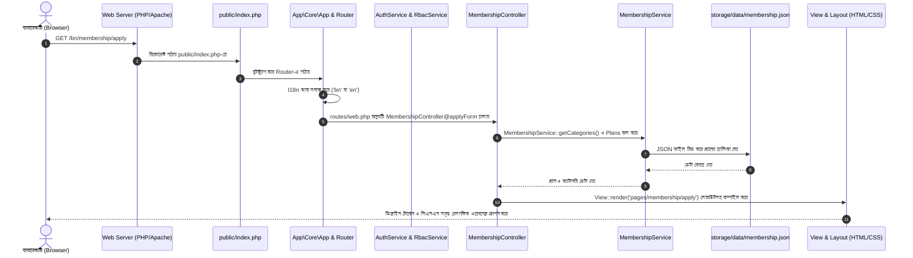

# সনাতন ফিলোসফি এন্ড স্ক্রিপচার (SPS) — প্ল্যাটফর্ম আর্কিটেকচার, ডিরেক্টরি ব্লুপ্রিন্ট ও লোকালহোস্ট গাইড

> [!NOTE]
> এই নথিতে এসপিএস (SPS) প্ল্যাটফর্মের অভ্যন্তরীণ আর্কিটেকচার, কোন ডিরেক্টরিতে কোন ফাইল কীভাবে কাজ করছে, লোকালহোস্টে রিকোয়েস্ট লাইফসাইকেল কীভাবে পরিচালিত হচ্ছে এবং আপনি নিজে কীভাবে এটি লোকাল পিসিতে চালাবেন—তার পূর্ণাঙ্গ বিশ্লেষণ দেওয়া হয়েছে।

---

## ১. সম্পূর্ণ সিস্টেমের লাইভ প্রিভিউ ও ভিডিও ডেমো

ব্রাউজার সাব-এজেন্টের মাধ্যমে লোকালহোস্টে রানিং সিস্টেমের একটি সম্পূর্ণ লাইভ ভিডিও ওয়াকথ্রু রেকর্ড করা হয়েছে:


### লাইভ সিস্টেমের প্রধান স্ক্রিনশটসমূহ:

````carousel

<!-- slide -->

<!-- slide -->

<!-- slide -->

<!-- slide -->

<!-- slide -->

<!-- slide -->

````

---

## ২. ডিরেক্টরি ব্লুপ্রিন্ট: কোন ফোল্ডারে কোন ফাইল কেন রাখা হয়েছে

প্রকল্পের রুট ডিরেক্টরি: `d:\AntiGravity Workspace\SPS`

```
SPS/
├── app/                        # কোর অ্যাপ্লিকেশন সোর্স কোড (MVC Architecture)
│   ├── Controllers/            # সকল এইচটিটিপি রিকোয়েস্ট নিয়ন্ত্রক (HTTP Controllers)
│   │   ├── BaseController.php      # বেস কন্ট্রোলার (view render, JSON response, redirect helpers)
│   │   ├── HomeController.php      # হোমপেজ ও শোকেস রেন্ডারিং
│   │   ├── SectionController.php   # এবাউট, এক্টিভিটিজ, কন্ট্যাক্ট ইত্যাদি মূল সেকশন
│   │   ├── BlogController.php      # ব্লগস্পট ফিড, রিডার, লাইক, কমেন্ট ও মেম্বার আর্টিকেল সাবমিশন
│   │   ├── LibraryController.php   # ডিজিটাল লাইব্রেরি, ওয়াটারমার্কড পিডিএফ স্ট্রিমার ও রিডার
│   │   ├── MembershipController.php# মেম্বারশিপ আবেদন, বিকাশ ট্রানজেকশন প্রসেসিং ও ড্যাশবোর্ড
│   │   └── AdminController.php     # সুপার অ্যাডমিন প্যানেল, আরবিএসি, ফাইন্যান্স ডেস্ক ও মডারেশন
│   ├── Core/                   # লাইটওয়েট ফ্রেমওয়ার্ক ইঞ্জিন (Core Framework Engine)
│   │   ├── App.php                 # অ্যাপ্লিকেশন বুটস্ট্র্যাপার (Bootstrap & Error Handling)
│   │   ├── Router.php              # ইউআরএল রাউটার ইঞ্জিন (RESTful routing + URI parameter extractor)
│   │   ├── Request.php             # এইচটিটিপি রিকোয়েস্ট র‍্যাপার (GET, POST, Headers, IP, Method)
│   │   ├── Response.php            # এইচটিটিপি রেসপন্স বিল্ডার (Status code, Headers, Output buffer)
│   │   ├── Session.php             # সিকিউর পিএইচপি সেশন ও ফ্ল্যাশ মেসেজ ম্যানেজার
│   │   ├── I18n.php                # দ্বিভাষিক ইঞ্জিন (বাংলা '/bn' ও ইংরেজি '/en' লোকালাইজেশন)
│   │   └── View.php                # ভিউ কম্পাইলার ও লেআউট র‍্যাপার
│   ├── Services/               # বিজনেস লজিক ও ডেটা এক্সেস লেয়ার (Domain Services)
│   │   ├── AuthService.php         # অ্যাডমিন লগইন অথেনটিকেশন, রোল ও কাস্টম এলাউন্স চেকার
│   │   ├── RbacService.php         # ১২টি রোল, পারমিশন ম্যাট্রিক্স ও সুপার অ্যাডমিন ক্ষমতা অর্পণ
│   │   ├── MembershipService.php   # মেম্বারশিপ লাইফসাইকেল, বিকাশ TrxID, সেন্ট এসএস ও লেজার
│   │   ├── BlogService.php         # ব্লগ পোস্ট ম্যানেজমেন্ট, মডারেশন কিউ ও মেম্বারশিপ ভেরিফিকেশন
│   │   ├── LibraryService.php      # বই ক্যাটালগ, ডিআরএম রিডার ও এক্সেস রিকোয়েস্ট প্রসেসর
│   │   ├── ActivityService.php     # প্রাতিষ্ঠানিক সেবা ও ইভেন্ট কার্যক্রম পরিচালনা
│   │   ├── ExecutiveService.php    # পরিচালনা পর্ষদ ও কর্মকর্তাদের পোর্টফোলিও
│   │   └── AuditService.php        # অপরিবর্তনীয় অডিট ট্রেইল (Immutable Security Audit Logging)
│   └── Views/                  # প্রেজেন্টেশন লেয়ার (PHP View Templates)
│       ├── components/             # রিইউজেবল উইজেটস (হেডার, ফুটার, সার্চ মোডাল)
│       ├── layouts/                # মাস্টার লেআউট (main.php সাধারণ পেজের জন্য, admin.php অ্যাডমিনের জন্য)
│       └── pages/                  # পেজ টেমপ্লেটসমূহ:
│           ├── home.php            # হোমপেজ
│           ├── about.php           # আমাদের সম্পর্কে ও পরিচালনা পর্ষদ
│           ├── activities.php      # সেবা ও ইভেন্ট কার্যক্রম
│           ├── blog/               # ব্লগ ফিড (index), আর্টিকেল ভিউ (show), রাইট ডেক্স (write)
│           ├── library/            # লাইব্রেরি ক্যাটালগ (index), বইয়ের বিবরণ (show), ফুলস্ক্রিন রিডার (reader)
│           ├── membership/         # পাবলিক মেম্বারশিপ হাব (index), আবেদন ফরম (apply), ড্যাশবোর্ড (dashboard), কিউআর ভেরিফাই (verify)
│           └── admin/              # অ্যাডমিন ড্যাশবোর্ড, ইউজার গভর্নেন্স, মেম্বারস, ব্লগস, লাইব্রেরি, রোলস, অডিট লগস
│
├── config/                     # কনফিগারেশন ফাইলসমূহ
│   └── app.php                 # অ্যাপ নাম, বেস ইউআরএল, ডিফল্ট ভাষা ও এনভায়রনমেন্ট সেটিংস
│
├── lang/                       # দ্বিভাষিক ডিকশনারি ও অনুবাদ স্ট্রিং
│   ├── bn/                     # বাংলা অনুবাদ ফাইলসমূহ (common.php, home.php)
│   └── en/                     # ইংরেজি অনুবাদ ফাইলসমূহ (common.php, home.php)
│
├── public/                     # পাবলিক ওয়েব রুট ডিরেক্টরি (Web Server Document Root)
│   ├── index.php               # অ্যাপ্লিকেশনের মূল এন্ট্রি পয়েন্ট (Front Controller)
│   ├── favicon.png / .svg      # প্রাতিষ্ঠানিক ব্র্যান্ড ফেভিকন
│   └── assets/                 # পাবলিক স্ট্যাটিক অ্যাসেট
│       ├── css/                # পিওর সিএসএস আর্কিটেকচার (tokens.css, typography.css, main.css, components.css)
│       ├── js/                 # ইন্টারঅ্যাক্টিভ ক্লায়েন্ট-সাইড স্ক্রিপ্টস (main.js)
│       └── images/             # লোগো, এক্সেকিউটিভ ছবি, পেমেন্ট এসভিজি ও বইয়ের কভার
│
├── storage/                    # ডাটাবেস ও স্টোরেজ ইঞ্জিন
│   ├── .gitignore              # storage/data ট্র্যাকিং নিশ্চিত করার কনফিগারেশন
│   └── data/                   # ফ্ল্যাট-ফাইল JSON ডাটাবেস (Zero-Dependency High-Speed Data Store)
│       ├── rbac.json           # ১২টি রোল, পারমিশন তালিকা এবং সকল অ্যাডমিন ব্যবহারকারীর ডেটা
│       ├── membership.json     # মেম্বারশিপ প্ল্যান, ক্যাটাগরি, নিবন্ধিত সদস্য ও পেমেন্ট ট্রানজেকশন
│       ├── blogs.json          # প্রকাশিত, অপেক্ষমাণ ও পর্যালোচনায় থাকা সকল ব্লগ পোস্ট
│       ├── activities.json     # প্রাতিষ্ঠানিক কার্যক্রম ও সমাজকল্যাণ ইভেন্ট
│       ├── access_requests.json# লাইব্রেরির বই পড়ার বিশেষ অনুরোধ তালিকা
│       └── audit_logs.json     # প্রশাসনিক প্রতিটি পদক্ষেপের অপরিবর্তনীয় অডিট লগ
│
├── Media/                      # প্রাতিষ্ঠানিক মূল আর্কাইভ ও ফাইল সংগ্রহ
│   ├── Executives/             # কর্মকর্তাদের মূল হাই-রেজ্যুলেশন ছবি
│   └── PDF-Libraries/          # লাইব্রেরির মূল সুরক্ষিত পিডিএফ বইসমূহ
│
├── routes/                     # ওয়েব রাউটিং কনফিগারেশন
│   └── web.php                 # সকল পাবলিক ও প্রশাসনিক ইউআরএল এন্ডপয়েন্ট ও কন্ট্রোলার ম্যাপিং
│
├── tests/                      # সম্পূর্ণ স্বয়ংক্রিয় টেস্ট স্যুট (Automated CLI Test Suites)
│   ├── test_membership_system.php # মেম্বারশিপ, বিকাশ Sent SS ও ফাইন্যান্স অফিসার ভেরিফিকেশন টেস্ট (৮৬/৮৬ পাস)
│   ├── test_rbac_admin.php        # সুপার অ্যাডমিন এক্তিয়ার, রোল ও এলাউন্স অ্যাসাইনমেন্ট টেস্ট (৭৭/৭৭ পাস)
│   ├── test_blog_phase.php        # ব্লগস্পট ক্লোন ও ডিআরএম প্রোটেকশন টেস্ট (৭৭/৭৭ পাস)
│   └── test_library_phase.php     # ডিজিটাল লাইব্রেরি ও পিডিএফ রিডার টেস্ট (২৯/২৯ পাস)
│
└── composer.json               # পিএইচপি ডিপেনডেন্সি ও PSR-4 অটোলোডিং কনফিগারেশন
```

---

## ৩. লোকালহোস্টে কীভাবে ডিসপ্লে হচ্ছে (How Localhost Serves the App)

এসপিএস প্ল্যাটফর্মটি একটি **আধুনিক ফ্রন্ট-কন্ট্রোলার প্যাটার্ন (Front Controller Pattern)** আর্কিটেকচারে তৈরি। আপনি যখন লোকাল ব্রাউজারে কোনো ইউআরএল (যেমন `http://127.0.0.1:8000/bn/membership/apply`) ব্রাউজ করেন, তখন নিচের ক্রমানুসারে ডেটা প্রদর্শিত হয়:



### বিশেষ সুরক্ষামূলক লাইফসাইকেল:
1. **দ্বিভাষিক পার্সিং (`I18n`):** ইউআরএল-এর প্রথম স্ল্যাশ দেখে (`/bn/...` নাকি `/en/...`) ভাষা নির্ধারণ করে এবং সিস্টেমের অনুবাদ ফাইল লোড করে।
2. **আরবিএসি সিকিউরিটি গেট (`AdminController` ও `AuthService`):** অ্যাডমিনের যেকোনো রুটে প্রবেশ করার সময় সেশন ভ্যালিডেশন হয়। যদি কেউ ফাইন্যান্স অফিসারের অনুমোদন বা সুপার অ্যাডমিনের রোলে অনুমতি ছাড়া অনুপ্রবেশ করতে চায়, কন্ট্রোলার তাকে আটকে দিয়ে `403 Forbidden` বা স্পষ্ট সতর্কবার্তা সহ রিডাইরেক্ট করে।
3. **অপরিবর্তনীয় লেজার:** কোনো মেম্বারশিপ অনুমোদন বা রোল পরিবর্তনের সাথে সাথে [AuditService.php](file:///d:/AntiGravity%20Workspace/SPS/app/Services/AuditService.php) স্বয়ংক্রিয়ভাবে [audit_logs.json](file:///d:/AntiGravity%20Workspace/SPS/storage/data/audit_logs.json)-এ অপরিবর্তনীয় লগ লিখে রাখে।

---

## ৪. আপনি নিজে কীভাবে লোকাল পিসিতে চালাবেন ও ব্যবহার করবেন (Step-by-Step Localhost Guide)

### ধাপ ১: কমান্ড লাইনে লোকাল সার্ভার চালু করা
আপনার প্রোজেক্ট ফোল্ডারে টার্মিনাল বা PowerShell ওপেন করে নিচের কমান্ডটি দিন:

```bash
php -S 127.0.0.1:8000 -t public public/index.php
```

> [!TIP]
> `public/index.php` রাউটার স্ক্রিপ্টটি যুক্ত করায় আপনার সব ক্লিন ইউআরএল (যেমন `/bn/membership`, `/bn/admin/users`) কোনো অ্যাপাচি বা Nginx ছাড়াই সরাসরি লোকালহোস্টে কাজ করবে।

সার্ভার চালু হলে টার্মিনালে দেখতে পাবেন:
`PHP 8.x Development Server (http://127.0.0.1:8000) started`

---

### ধাপ ২: ব্রাউজারে প্রয়োজনীয় লিংকসমূহ ভিজিট করা

| বিভাগ | ইউআরএল | বিবরণ |
|---|---|---|
| 🌐 **হোমপেজ** | `http://127.0.0.1:8000/bn` | মূল হোমপেজ, সংবাদ, ইভেন্ট ও বাণী |
| 🪪 **মেম্বারশিপ হাব** | `http://127.0.0.1:8000/bn/membership` | মেম্বারশিপ প্ল্যান ও সুযোগ-সুবিধা |
| 📝 **আবেদন ফরম** | `http://127.0.0.1:8000/bn/membership/apply` | বিকাশ TrxID ও সেন্ট মানি স্ক্রিনশটসহ আবেদন |
| 💳 **মেম্বার ড্যাশবোর্ড** | `http://127.0.0.1:8000/bn/membership/dashboard?as=SPS-000872` | ডিজিটাল মেম্বারশিপ কার্ড ও কিউআর লিংক |
| 🔐 **অ্যাডমিন লগইন** | `http://127.0.0.1:8000/bn/admin/login` | প্রশাসনিক নিয়ন্ত্রণকক্ষে প্রবেশের লগইন পেজ |
| 👑 **ইউজার ও রোল গভর্নেন্স** | `http://127.0.0.1:8000/bn/admin/users` | সুপার অ্যাডমিন কর্তৃক দায়িত্ব ও এলাউন্স অর্পণ ডেস্ক |
| 🪙 **ফাইন্যান্স ভেরিফিকেশন ডেস্ক** | `http://127.0.0.1:8000/bn/admin/members?tab=payments` | কোষাধ্যক্ষের পেমেন্ট অডিট ও ভেরিফিকেশন ডেস্ক |
| ✍️ **ব্লগ ও সাহিত্য জার্নাল** | `http://127.0.0.1:8000/bn/blog` | সনাতনী জ্ঞানপীঠ ও পাঠকদের প্রবন্ধ ফিড |
| 📚 **ডিজিটাল লাইব্রেরি** | `http://127.0.0.1:8000/bn/library` | ডিআরএম ওয়াটারমার্কড ই-বুক সংগ্রহ |

---

### ধাপ ৩: অ্যাডমিন অ্যাকাউন্টে লগইন করা

অ্যাডমিন প্যানেলে লগইন করতে ব্রাউজারে `http://127.0.0.1:8000/bn/admin/login` ঠিকানায় যান:

* **সুপার অ্যাডমিন (সভাপতি - অনিক কুমার সাহা):**
  - ইউজারনেম: `anik` অথবা `president@sps.org`
  - পাসওয়ার্ড: `sps@admin2026`
  *(ক্ষমতা: প্ল্যাটফর্মের পূর্ণ নিয়ন্ত্রণ, যেকোনো কর্মকর্তাকে রোল, দায়িত্ব ও বিশেষ এলাউন্স দেওয়ার একক অধিকার)*

* **কোষাধ্যক্ষ / ফাইন্যান্স অফিসার (জয় চক্রবর্তী):**
  - ইউজারনেম: `joy` অথবা `treasurer@sps.org`
  - পাসওয়ার্ড: `sps@admin2026`
  *(ক্ষমতা: মেম্বারশিপ পেমেন্ট, TrxID ও বিকাশ সেন্ট মানি স্ক্রিনশট যাচাই এবং মেম্বার সক্রিয় করার একক নির্বাহী ক্ষমতা)*

* **সাধারণ সম্পাদক (অ্যাডমিন - রবিন দে):**
  - ইউজারনেম: `robin` অথবা `general.secretary@sps.org`
  - পাসওয়ার্ড: `sps@admin2026`
  *(ক্ষমতা: পরিচালনা, সাহিত্য ও তত্ত্বাবধানমূলক মনিটরিং)*

* **সাংগঠনিক সম্পাদক (অ্যাডমিন - লিখন ঘোষ):**
  - ইউজারনেম: `likhon` অথবা `organizing.secretary@sps.org`
  - পাসওয়ার্ড: `sps@admin2026`
  *(ক্ষমতা: সংগঠন পরিচালনা ও তত্ত্বাবধানমূলক মনিটরিং)*

---

### ধাপ ৪: সুপার অ্যাডমিন হিসেবে দায়িত্ব ও এলাউন্স বণ্টন পরীক্ষা করা
1. `anik` দিয়ে লগইন করে `http://127.0.0.1:8000/bn/admin/users` পেজে যান।
2. যেকোনো কর্মকর্তার নামের ডানপাশে থাকা নীল রঙের **`⚙️ দায়িত্ব ও ক্ষমতা নির্ধারণ`** বোতামে ক্লিক করুন।
3. একটি আধুনিক মোডাল ওপেন হবে:
   - কর্মকর্তার জন্য নতুন **ভূমিকা (Role)** বেছে নিন।
   - **কাজের বিভাগ (Department / Scope)** ঘরে কাস্টম দায়িত্ব লিখুন অথবা এক ক্লিকে চিপস সিলেক্ট করুন (উদাঃ `সাহিত্য ও প্রকাশনা বিভাগ`, `হিসাব ও অডিট শাখা`)।
   - রোলের নির্ধারিত ক্ষমতার বাইরে অতিরিক্ত কোনো কাজ করাতে চাইলে **বিশেষ কাজের অনুমতি (Task Allowances)** গ্রিড থেকে নির্দিষ্ট চেকবক্স টিক দিন (উদাঃ `blog.publish`, `library.manage`)।
4. **`✓ দায়িত্ব ও ক্ষমতা সংরক্ষণ করুন`** চাপুন। ডেটা অবিলম্বে সংরক্ষিত হবে এবং অডিট ট্রেইলে যুক্ত হবে।

---

### ধাপ ৫: স্বয়ংক্রিয় টেস্ট পরিচালনা করে সিস্টেম যাচাই
যেকোনো সময় কোড বা লজিক যাচাই করতে টার্মিনালে নিচের কমান্ডগুলো চালাতে পারেন:

```bash
# মেম্বারশিপ ও পেমেন্ট ভেরিফিকেশন টেস্ট (৮৬টি টেস্ট)
php tests/test_membership_system.php

# সুপার অ্যাডমিন গভর্নেন্স ও আরবিএসি টেস্ট (৭৭টি টেস্ট)
php tests/test_rbac_admin.php

# ব্লগস্পট ক্লোন ও ডিআরএম প্রোটেকশন টেস্ট (৭৭টি টেস্ট)
php tests/test_blog_phase.php

# ডিজিটাল লাইব্রেরি ও বুক রিডার টেস্ট (২৯টি টেস্ট)
php tests/test_library_phase.php
```

সমস্ত টেস্টের ফলাফল **শতভাগ পাস (`ALL TESTS PASSED SUCCESSFULLY! ✓`)** হিসেবে প্রদর্শিত হবে।
